## Provisionamento de Serviços do OCI

# 🎯 **Objetivos**

Demonstrar de forma prática e ágil o provisionamento das soluções dentro do OCI.

O que você aprenderá **durante este workshop**:

- Criar **em poucos cliques** um banco de dados autônomo no Oracle Cloud Infrastructure (OCI);
- Desenvolver em **20 minutos** uma plataforma low-code para consultas em PDFs;
- Utilizar modelos de IA Generativa para **coletar informações de documentos em imagem**;
- Provisionar uma plataforma de **autoatendimento de Análise de Negócio** (Oracle Analytics Cloud);

# ⚠️ **ATENÇÃO**:

- **DOWNLOAD:** Faça o download do ZIP ([ARQUIVOS-FAST-TRACK](https://objectstorage.us-ashburn-1.oraclecloud.com/n/idi1o0a010nx/b/Fast_Track/o/ARQUIVOS_FAST_TRACK.zip)), pois os arquivos serão utilizados nos próximos laboratórios.

- **SENHA:** Durante o provisionamento dos recursos, é necessário a criação de senhas. Utilize a senha recomendada: **WORKSHOPsec2019##**

- **COMPARTMENT:** Realize todos os provisionamentos no compartimento **ROOT**, conforme indicado no tutorial.


### _**Aproveite sua experiência na Oracle Cloud!**_

## 📌 Introdução

>**A única nuvem que oferece serviços de nuvem completos em todo o mundo, entre nuvens ou em seu data center.** 
1. **Multicloud**
Faça várias nuvens funcionarem como uma. A Oracle oferece integração direta de banco de dados com o Microsoft Azure, bem como interconexão de alto desempenho.
2. **Nuvem Pública**
A única nuvem com um conjunto consolidado de serviços e preços baixos consistentes em regiões de nuvens públicas comerciais e governamentais.
3. **Nuvem Híbrida**
Soluções de nuvem confiáveis para praticamente qualquer local, incluindo Oracle Exadata Cloud@Customer, um banco de dados como serviço altamente otimizado já implementado em mais de 60 países.
4. **Nuvem Dedicada**
OCI Dedicated Region e Oracle Alloy são os únicos produtos que fornecem mais de 100 serviços a preços de nuvem pública inteiramente em seus data centers.


### **Recursos e Suporte**:

- **Documentação da Oracle Cloud**: [Documentação do Oracle Cloud Infrastructure](https://docs.oracle.com/pt-br/iaas/Content/home.htm)
- **Introdução**: [Why Oracle Cloud Infrastructure](https://www.youtube.com/watch?v=ljiUqro6_Mc)


## 1️⃣ Validação da Região

1. Faça o login no [Oracle Cloud Infrastructure (OCI)](https://cloud.oracle.com/) e valide se a região de **Chicago** ou **São Paulo** se encontra disponível para uso.

   > **Se sua região não for uma das indicadas, as aplicações que utilizam inteligência artificial generativa não estarão disponíveis.**

   


## 2️⃣ Criação do Autonomous Database

1. Clique no menu **(☰)** e selecione **Database ⮕ Autonomous Database**.

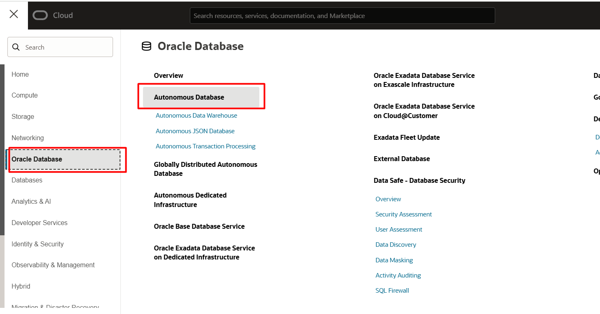

2. Na página de gestão de Autonomous Databases, clique em **Create Autonomous Database**.
   
> **ATENÇÃO:** Selecione o **Compartment** com nome de ```<NomeTenancy>(root)```

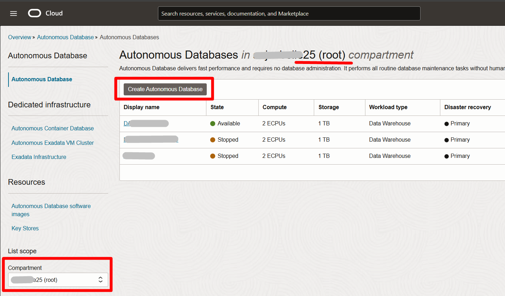
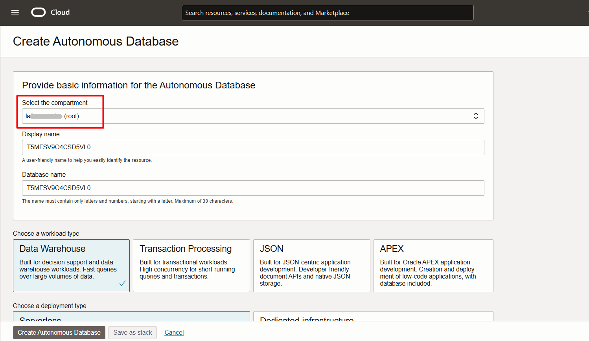

3. Selecione **ADW - Data Warehouse**


4. Escolha a versão 23ai para o banco de dados:


5. Utilize a senha recomendada: **WORKSHOPsec2019##** . Selecione **secure access from everywhere** e clique em **Create Autonomous Database**:
<br><br>

> **ATENÇÃO**: Verifique se utilizou a senha recomendada **WORKSHOPsec2019##**


6. **Vá para o próximo laboratório.**

> **Status do Autonomous Database:**
> - Ícone amarelo = Em criação; 
> - Ícone verde = Pronto para uso;


## 3️⃣ Deletar Instâncias de Compute
1. Clique no menu **(☰)** e selecione **Compute ⮕ Intences**
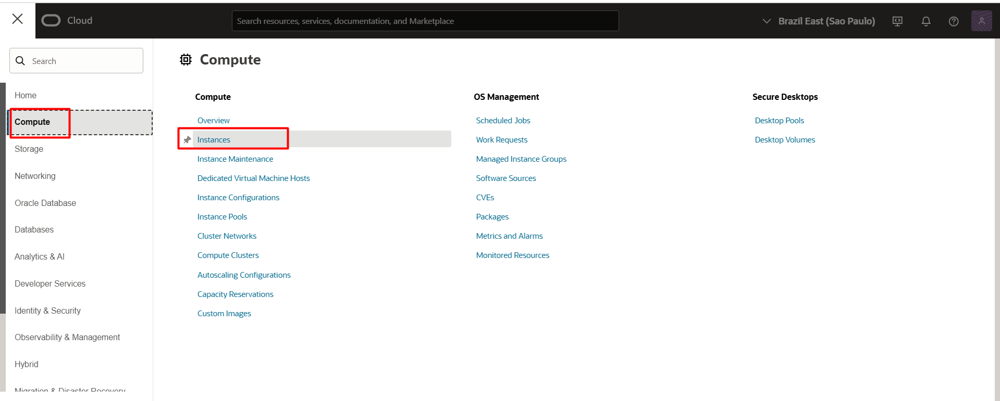

2. Verefique que está no compartimento **Compartimento-Trial**
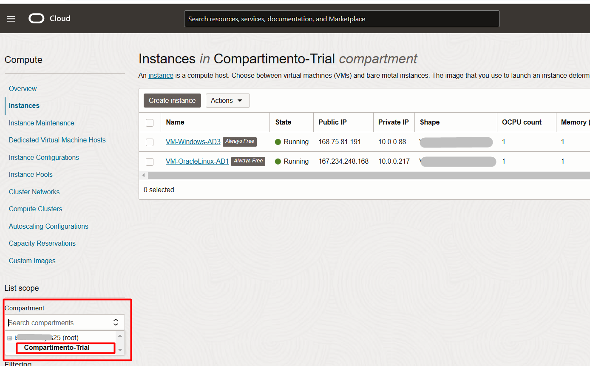

3. Selecione as máquinas que devem ser deletadas, clique no botão Actions, escolha **Terminate**
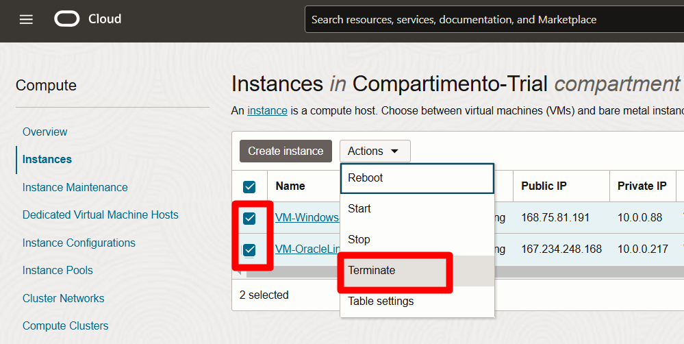

4. Selecione as caixas de aviso para deletar as máquinas e clique em **Terminate**
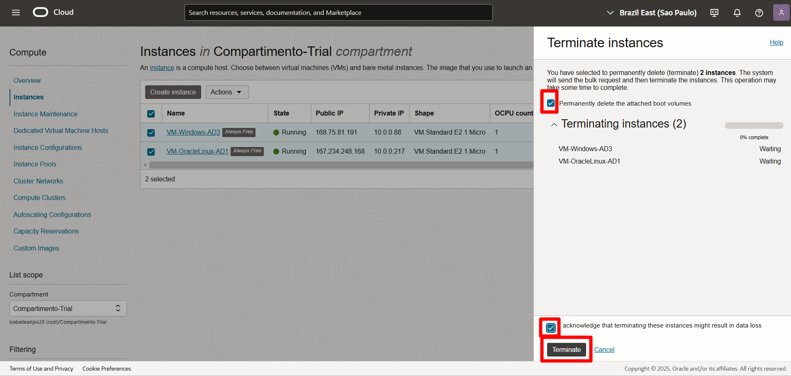
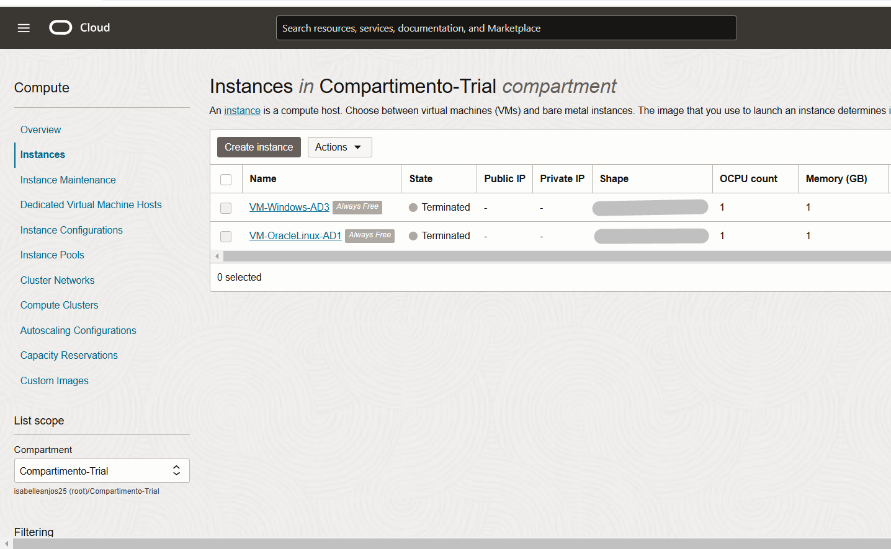

## 4️⃣ Criação do Oracle Analytics Cloud

1. Clique no menu **(☰)** e selecione **Analytics & AI ⮕ Analytics Cloud**.


2. Na página de gestão do Oracle Analytics Cloud, clique em **Create Instance**.

> **ATENÇÃO:** Selecione o **Compartment** com nome de ```<NomeTenancy>(root)```
  


1. Dê um nome a instância do Analytics Cloud. Selecione o **Compartment** com nome de ```<NomeTenancy>(root)``` e mantenha as outras configurações padrão. Ao finalizar clique em **Create**.


4. **Vá para o próximo laboratório.**

> **Status do Oracle Analytics Cloud:**
> - Ícone amarelo = Em criação; 
> - Ícone verde = Pronto para uso;

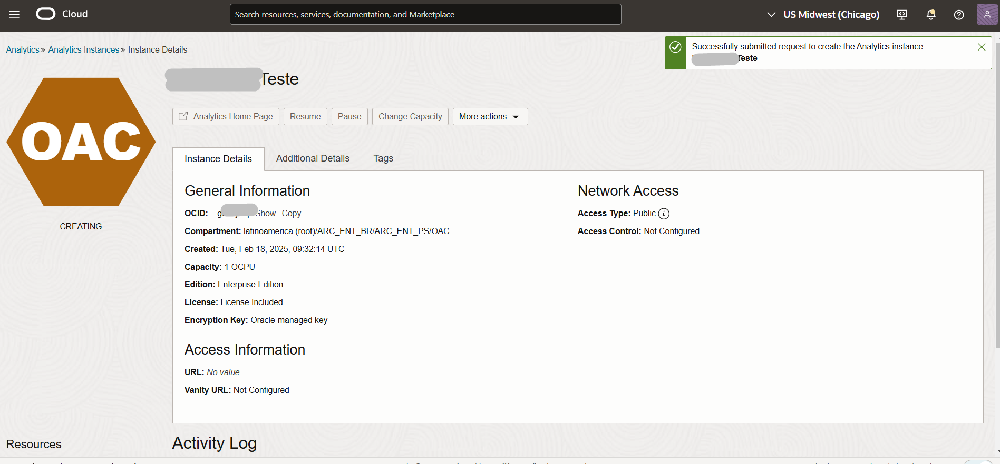


## 5️⃣ Criação de Notebook OCI Data Science

Antes de criar o ambiente de código, vamos configurar as permissões necessárias para a interação entre os serviços.

1. Clique no menu **(☰)** e selecione **Identity & Security ⮕ Policies**


2. Clique em **Create Policy**. 
> **ATENÇÃO:** Selecione o **Compartment** com nome de ```<NomeTenancy>(root)```
<br> 
  


3. Escolha o **Compartment**: <<'NomeTenancy'>>**root**. Em seguida, dê um nome e uma descrição.
 - **NOME: policies-data-science** 
 - **DESCRIÇÃO: Políticas para Data Science**

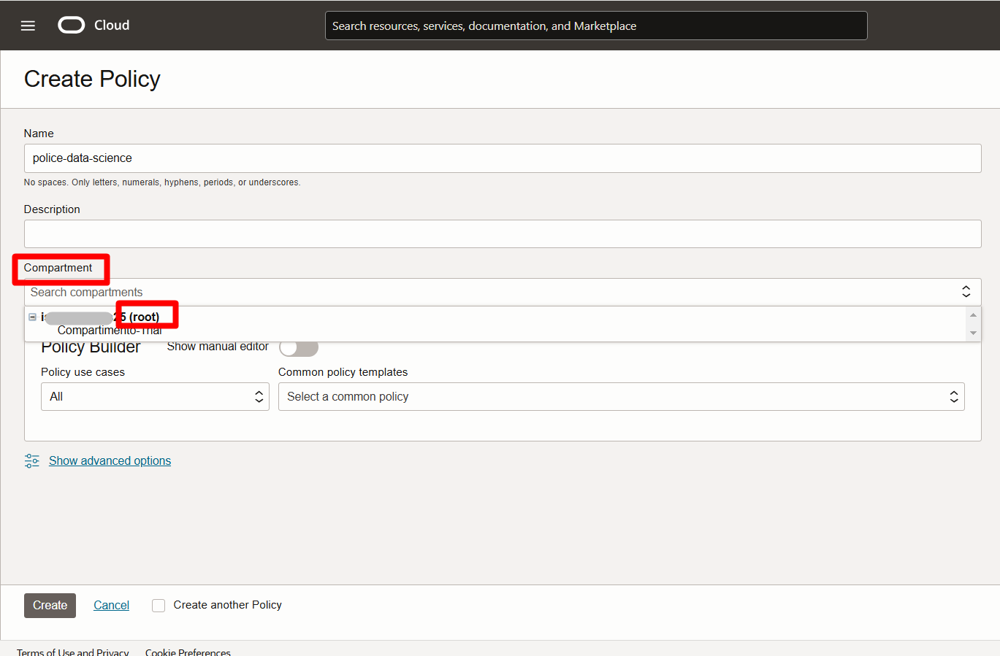


4.Selecione **Show Manual Editor** e adicione a frase abaixo. Copie e cole a frase exatamente como está abaixo. Em seguida, clique em **Create**.

    <copy>  
    allow any-user to manage generative-ai-family in tenancy
    </copy>  
<!-- Separador -->
> **ATENÇÃO:** Não é necessário ajustar o conteúdo da policy, mantenha a frase como indicado acima.

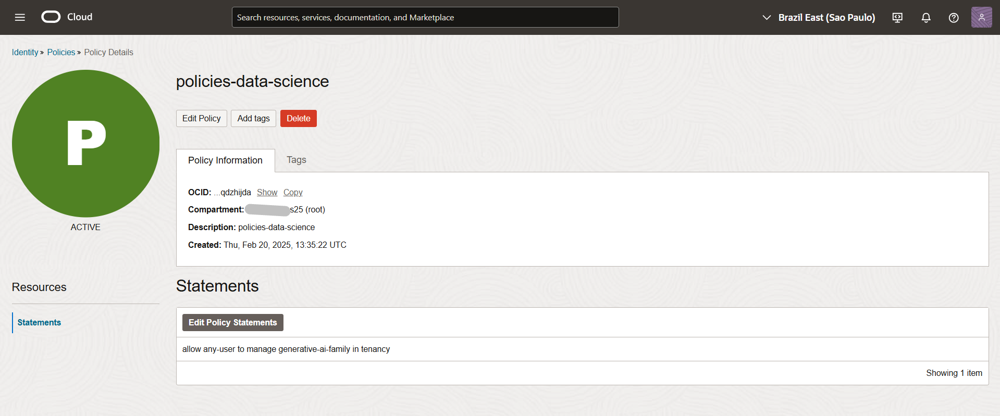

5. Clique no menu de hambúrger do canto superior esquerdo da tela, selecione **Analytics & AI ⮕ Data Science**


6. Clique em **Create Project**, escolha o Compartment: <<'NomeTenancy'>>root, defina um nome para o projeto e em seguida, clique em **Create**, na região inferior da tela.
> **ATENÇÃO:** Selecione o **Compartment** com nome de ```<NomeTenancy>(root)```


7. Selecione o nome do projeto e em seguida, clique em **Create Notebook Session**


8. Considere as seguintes configurações e em seguida, clique em **Create**:

- **Name:** dataprev-fast-track
- **Shape:** VM.Standard.E4.Flex Virtual machine, 1 core OCPU, 16 GB memory. Caso não disponível, selecionar VM.Standard.E3.Flex
- **Network Resources:** Default Networking ⮕ Public Endpoint


Você está pronto para prosseguir para o próximo laboratório.


## 6️⃣ [Extra] Situação das Instâncias 

1. Clique no símbolo da Oracle Cloud, no canto superior esquerdo. Na página inicial, você verá os últimos serviços acessados e o status de cada um, conforme mostrado na imagem a seguir.

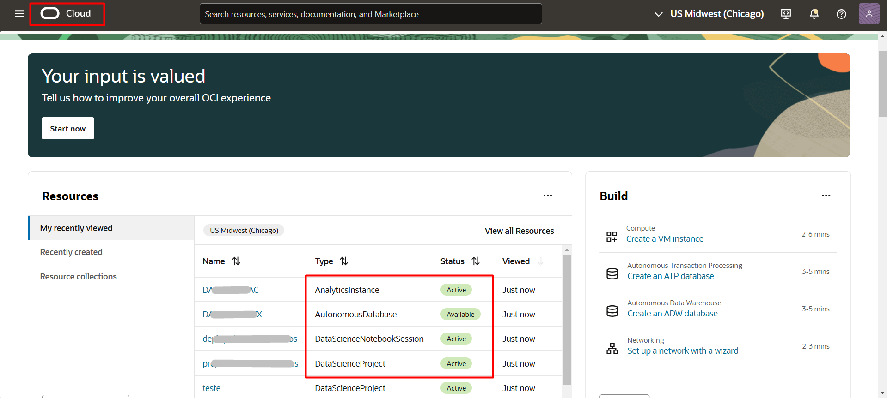

### **[OPCIONAL - Verificação Individual]**
Para visualizar cada instância, você pode clicar no nome da instância ou navegar pelo OCI acessando os serviços. Os passos para acessar essas instâncias estão detalhados a seguir.

#### AUTONOMOUS DATABASE

1. Clique no menu **(☰)** e selecione **Database ⮕ Autonomous Database**.


#### ANALYTICS CLOUD

2. Clique no menu **(☰)** e selecione **Analytics & AI ⮕ Analytics Cloud**. Selecione seu Oracle Analytics.


#### OCI DATA SCIENCE

3. Clique no menu **(☰)** e selecione **Analytics & AI ⮕ Data Science**. Selecione seu projeto.


6. Selecione seu Notebook. 
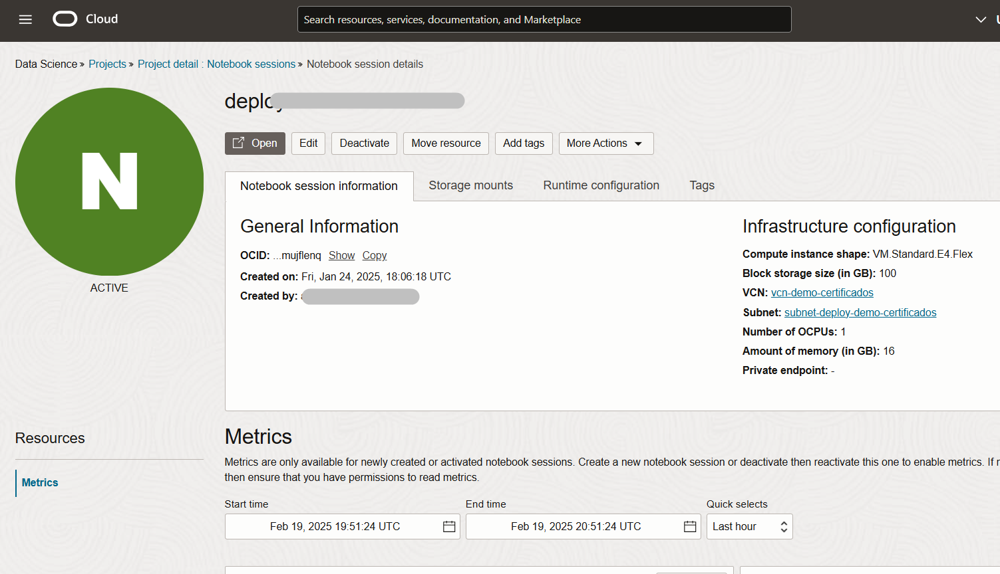


<br>

🎉🎉 Parabéns, você terminou os Laboratórios de **Criação dos Serviços** 🎉🎉

<br>

## 👥 Agradecimentos

- **Autores** - Caio Oliveira
- **Autores Contribuintes** - Isabelle Anjos, Gabriela Miyazima, Aristotelles Serra
- **Última Atualização Por/Data** - Janeiro 2025

## 🛡️ Declaração de Porto Seguro (Safe Harbor)

O tutorial apresentado tem como objetivo traçar a orientação dos nossos produtos em geral. É destinado somente a fins informativos e não pode ser incorporado a um contrato. Ele não representa um compromisso de entrega de qualquer tipo de material, código ou funcionalidade e não deve ser considerado em decisões de compra. O desenvolvimento, a liberação, a data de disponibilidade e a precificação de quaisquer funcionalidades ou recursos descritos para produtos da Oracle estão sujeitos a mudanças e são de critério exclusivo da Oracle Corporation.

Esta é a tradução de uma apresentação em inglês preparada para a sede da Oracle nos Estados Unidos. A tradução é realizada como cortesia e não está isenta de erros. Os recursos e funcionalidades podem não estar disponíveis em todos os países e idiomas. Caso tenha dúvidas, entre em contato com o representante de vendas da Oracle. 
