## Provisionar Serviços do OCI

A seguir o passo a passo do laboratório.
### **Recursos e Suporte**:

- **Documentação da Oracle Cloud**: [Documentação do Oracle Cloud Infrastructure](https://docs.oracle.com/pt-br/iaas/Content/home.htm)
- **Introdução**: [Why Oracle Cloud Infrastructure](https://www.youtube.com/watch?v=ljiUqro6_Mc)

### _**Aproveite sua experiência na Oracle Cloud!**_

## 📌 Introdução

>**A única nuvem que oferece serviços de nuvem completos em todo o mundo, entre nuvens ou em seu data center.** 
1. **Multicloud**
Faça várias nuvens funcionarem como uma. A Oracle oferece integração direta de banco de dados com o Microsoft Azure, bem como interconexão de alto desempenho.
2. **Nuvem Pública**
A única nuvem com um conjunto consolidado de serviços e preços baixos consistentes em regiões de nuvens públicas comerciais e governamentais.
3. **Nuvem Híbrida**
Soluções de nuvem confiáveis para praticamente qualquer local, incluindo Oracle Exadata Cloud@Customer, um banco de dados como serviço altamente otimizado já implementado em mais de 60 países.
4. **Nuvem Dedicada**
OCI Dedicated Region e Oracle Alloy são os únicos produtos que fornecem mais de 100 serviços a preços de nuvem pública inteiramente em seus data centers.
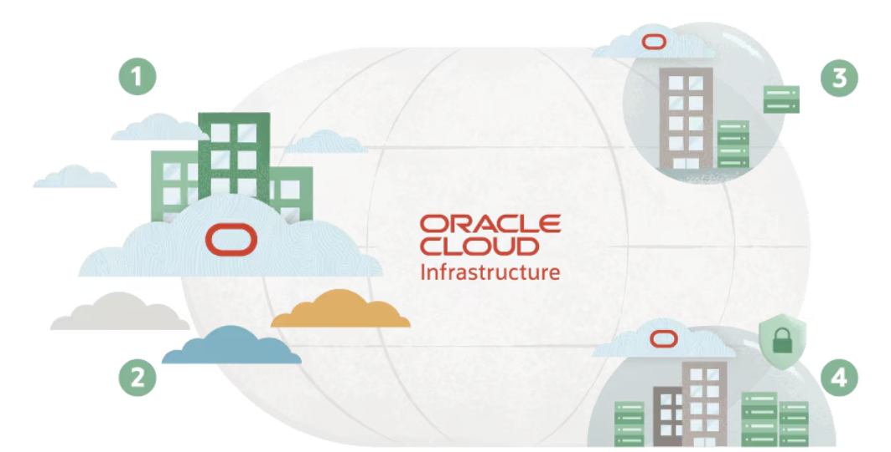

### 📌 **Objetivos**

Demonstrar de forma prática como é fácil e ágil o provisionamento das soluções dentro do OCI.

O que você aprenderá:

- Criar um banco de dados autônomo (Autonomous Database) no Oracle Cloud Infrastructure (OCI);
- Provisionar Oracle Analytics Cloud, plataforma de autoatendimento de Análise de Negócio;
- Fazer a configuração do AI Agent.

 

## 1️⃣ Validação de Região

1. Faça o login no Oracle Cloud Infrastructure (OCI) e valide se a região de Chicago se encontra disponível para uso.

   

> **Caso a região de Chicago não esteja disponível, clique em manage region (caso já esteja disponível pule para a sessão 2 - Criação de Autonomous Database)** 
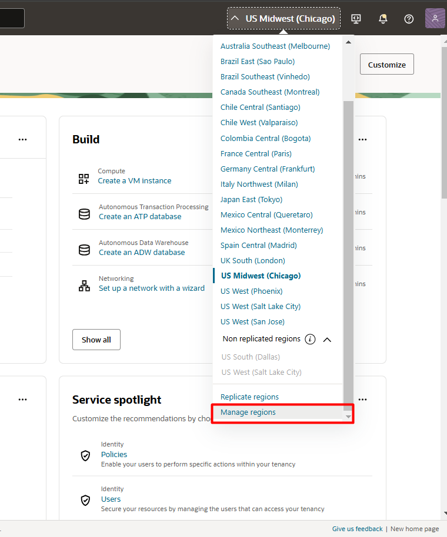

2. Busque por **US Midwest (Chicago)** e clique no botão subscribe. O processo de subscrição pode levar alguns minutos, aguarde para dar sequência ao workshop. Clique no ícone escrito **Oracle Cloud** no canto esquerdo e faça logoff e login para validar se a região já foi subscrita.

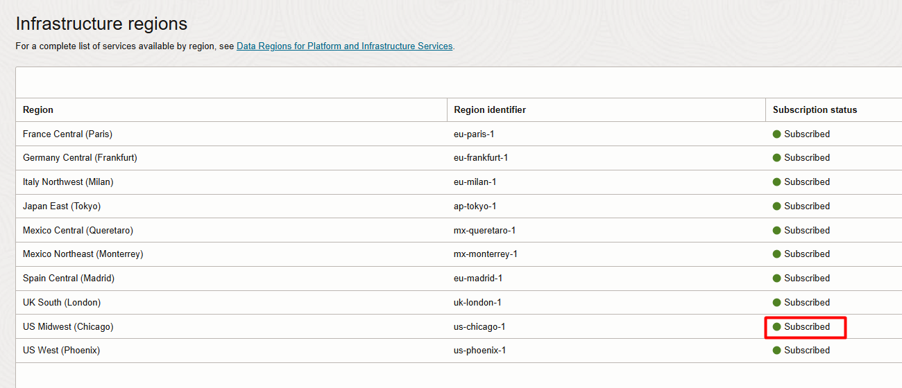

## 2️⃣ Criação de Autonomous Database

1. Clique no menu de hambúrger do canto superior esquerdo da tela, na sequência navegue até a página de gestão de autonomous databases.

2. Na página de gestão de Autonomous Databases, clique em create autonomous database. Selecione **ATP ou ADW**
  

3. Escolha a versão 23ai para o banco de dados:

4. Coloque a senha **WORKSHOPsec2019##** , escolha **secure access from everywhere** e clique em **Create Autonomous Database**:
  

5. Aguarde até a conclusão da criação: 
- Ícone amarelo = criando; 
- Ícone verde = pronto para uso;
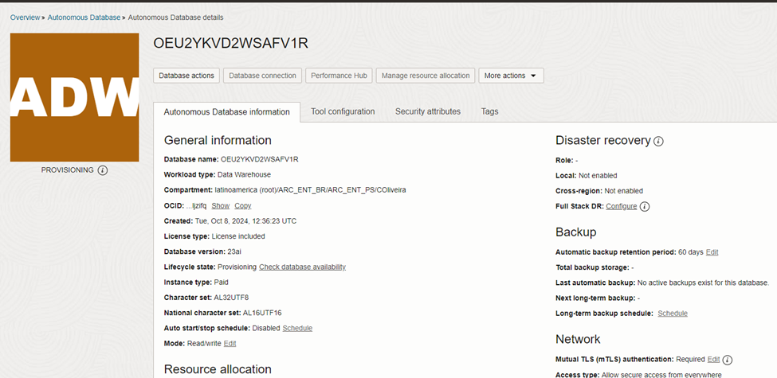

## 3️⃣ Criação do Oracle Analytics Cloud

Clique no menu de hambúrger do canto superior esquerdo da tela, na sequência navegue até a página de gestão do Oracle Analytics Cloud.

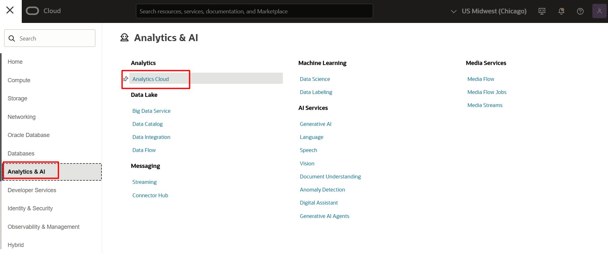

Na página de gestão do Oracle Analytics Cloud, clique em **Create Instance**.
  
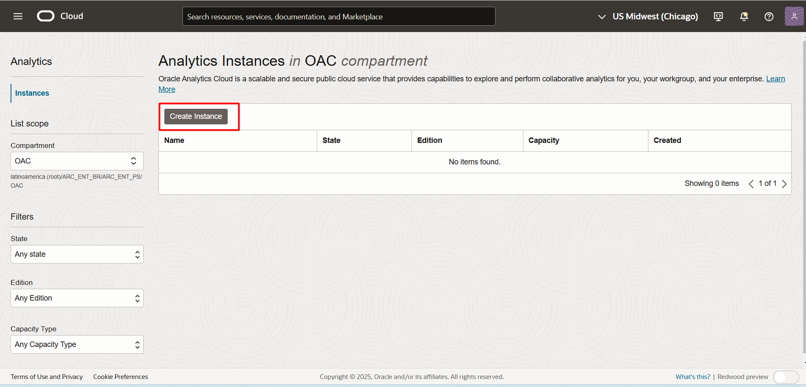

Dê um nome a instância do Analytics Cloud e mantenha as outras configurações como na imagem a seguir. Ao finalizar clique em **Create**:

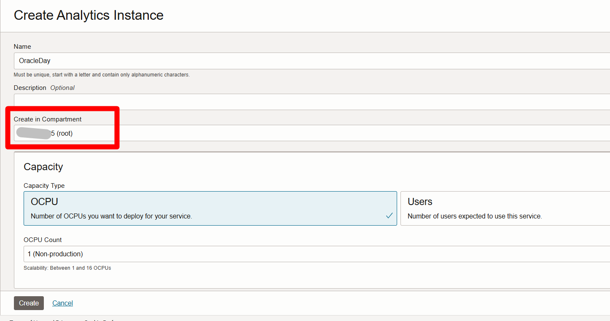

Aguarde até a conclusão da criação: 
- Ícone amarelo = criando; 
- Ícone verde = pronto para uso;
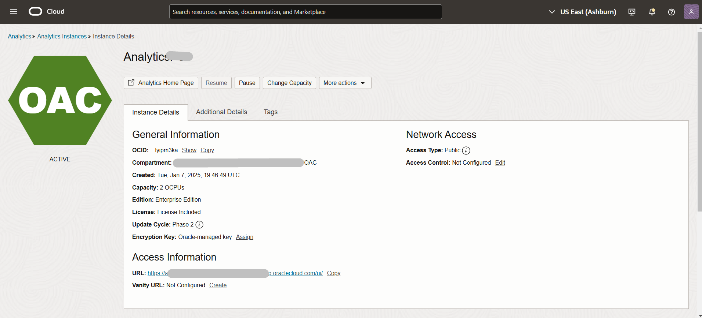

## 4️⃣ Criação de Notebook OCI Data Science

Antes de criar o ambiente de código, vamos configurar as permissões necessárias para a interação entre os serviços.

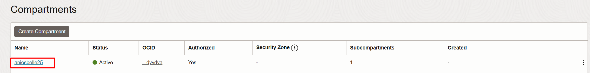

Clique no menu de hambúrger do canto superior esquerdo da tela, selecione **Identity & Security ⮕ Policies**

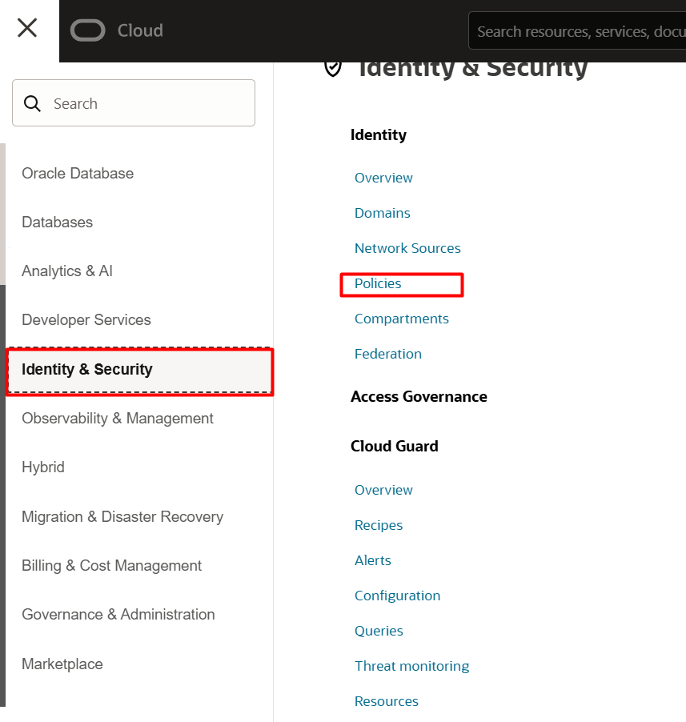

Clique em **Create Policy**. Em seguida, selecione **Show Manual Editor** e aidicione a frase abaixo. Em seguida, clique em **Create**.

    <copy>  
    allow any-user to manage generative-ai-family in tenancy
    </copy>  
<!-- Separador -->

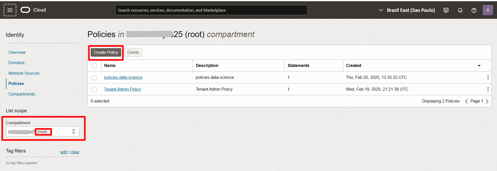

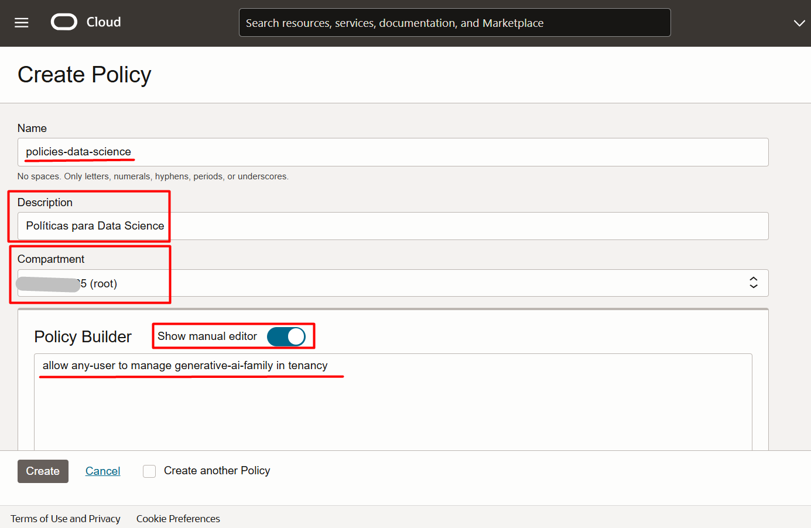

Clique no menu de hambúrger do canto superior esquerdo da tela, selecione **Analytics & AI ⮕ Data Science**

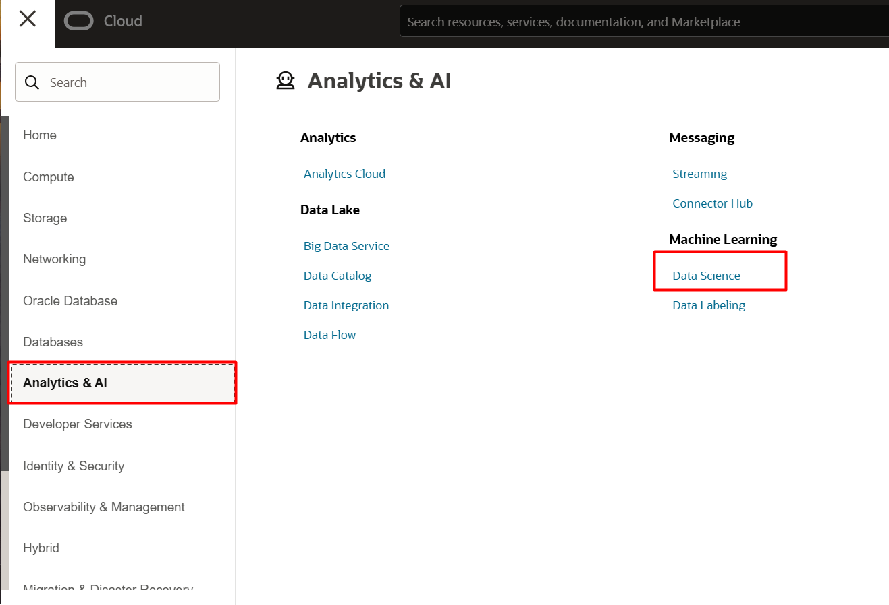

Clique em **Create Project**, defina um nome para o projeto e em seguida, clique em **Create**, na região inferior da tela.

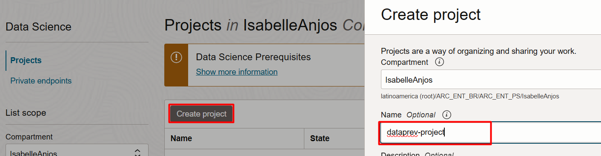

Selecione o nome do projeto e em seguida, clique em **Create Notebook Session**

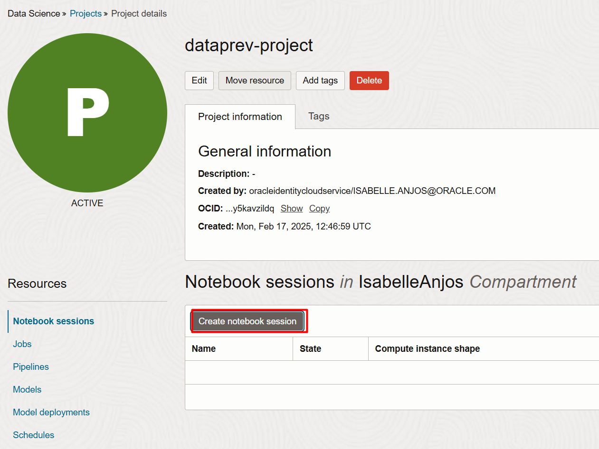

Considere as seguintes configurações e em seguida, clique em **Create**:

- **Name:** dataprev-fast-track
- **Shape:** VM.Standard.E4.Flex Virtual machine, 1 core OCPU, 16 GB memory. Caso não disponível, selecionar VM.Standard.E3.Flex
- **Network Resources:** Default Networking ⮕ Public Endpoint

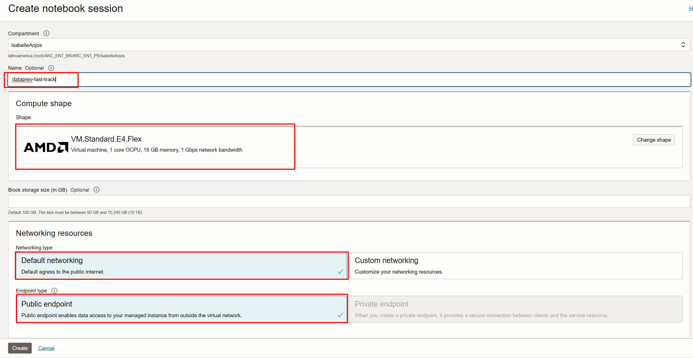

Após a criação do OCI Data Science, você está pronto para prosseguir para o próximo laboratório.

## 👥 Agradecimentos

- **Autores** - Caio Oliveira
- **Autores Contribuintes** - Isabelle Anjos, Gabriela Miyazima, Aristotelles Serra
- **Última Atualização Por/Data** - Janeiro 2025

## 🛡️ Declaração de Porto Seguro (Safe Harbor)

O tutorial apresentado tem como objetivo traçar a orientação dos nossos produtos em geral. É destinado somente a fins informativos e não pode ser incorporado a um contrato. Ele não representa um compromisso de entrega de qualquer tipo de material, código ou funcionalidade e não deve ser considerado em decisões de compra. O desenvolvimento, a liberação, a data de disponibilidade e a precificação de quaisquer funcionalidades ou recursos descritos para produtos da Oracle estão sujeitos a mudanças e são de critério exclusivo da Oracle Corporation.

Esta é a tradução de uma apresentação em inglês preparada para a sede da Oracle nos Estados Unidos. A tradução é realizada como cortesia e não está isenta de erros. Os recursos e funcionalidades podem não estar disponíveis em todos os países e idiomas. Caso tenha dúvidas, entre em contato com o representante de vendas da Oracle. 
