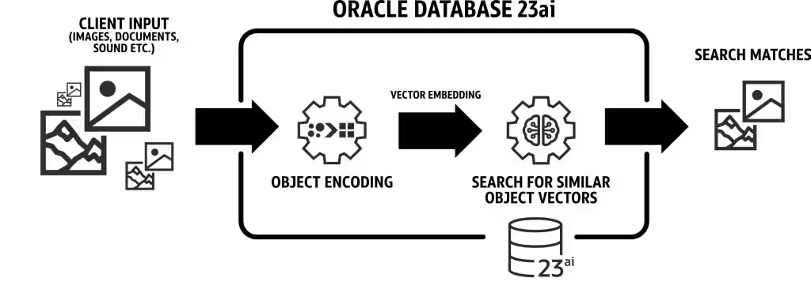
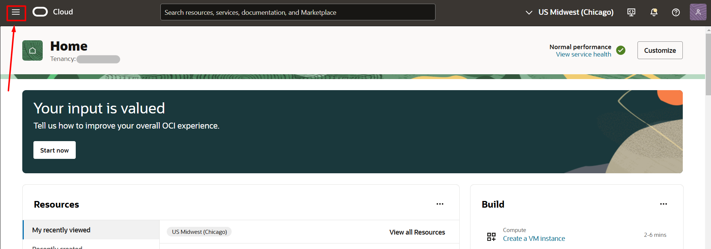
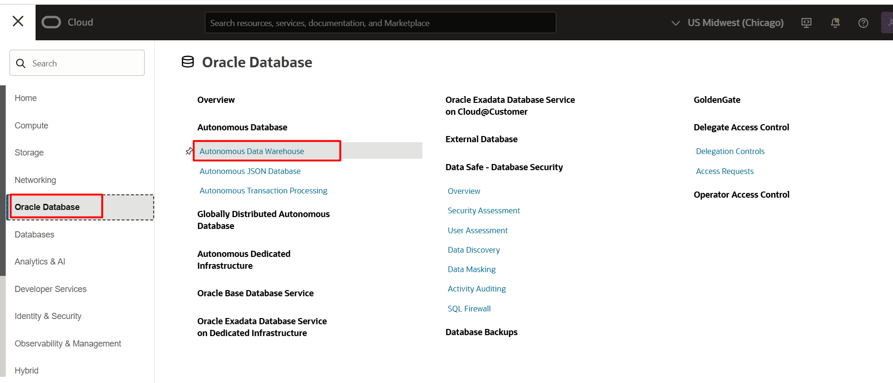
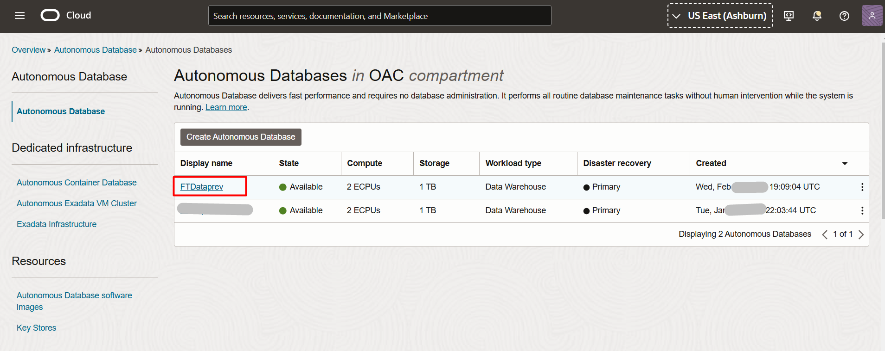

# Oracle 23ai Vector Search

## 📌 Introdução

>**Com o Oracle 23c AI, o AI Vector Search integra vetores ao Oracle Database, eliminando bancos especializados e evitando a fragmentação de dados. Essa tecnologia permite buscas por similaridade combinadas com SQL simples, potencializando modelos de linguagem (LLMs) com contexto adicional. Inclui novo tipo de dado vetorial, índices específicos e extensões SQL para análises avançadas diretamente no banco de dados.** 

Referência: [Announcing Oracle Database 23ai : General Availability
](https://blogs.oracle.com/database/post/oracle-23ai-now-generally-available)

### ➡️ **O que é Vector Database?**

> Um banco de dados vetorial é qualquer banco de dados que pode armazenar e gerenciar embeddings vetoriais de forma nativa e lidar com os dados não estruturados que eles descrevem, como documentos, imagens, vídeos ou áudios.

### ➡️ **Como o Oracle AI Vector Search revoluciona a busca de dados semânticos no Oracle Database?**

> O Oracle AI Vector Search permite criar tabelas com o novo tipo de dado VECTOR, armazenando vetores diretamente no banco de dados. É possível inserir vetores com INSERT, carregar dados usando SQL Loader ou Data Pump, e criar índices para otimizar buscas em embeddings. Novas funções SQL, como as de cálculo de distância vetorial, facilitam a análise de vetores, enquanto operadores adicionais permitem criar, converter e descrever vetores, além de realizar chunking e embeddings de dados de forma eficiente.

 

### 📌 **Objetivos**

Demonstrar de forma prática como utilizar a funcionalidade de busca vetorial do Oracle 23c AI Vector Search.

O que você aprenderá:

- Criar e configurar um banco de dados autônomo (Autonomous Database) no Oracle Cloud Infrastructure (OCI).
- Utilizar a funcionalidade de busca vetorial para otimizar consultas e análises.
- Explorar as vantagens do Oracle 23c AI na integração de dados relacionais e semânticos.

 
### **Recursos e Suporte**:

- **Documentação da Oracle Cloud**: [Getting started with vectors in 23ai](https://blogs.oracle.com/coretec/post/getting-started-with-vectors-in-23ai)
- **Tutoriais**: [Oracle Database 23ai - Oracle AI Vector Search & Retrieval Augmented Generation (RAG) with Oracle APEX](https://www.linkedin.com/pulse/oracle-database-23ai-ai-vector-search-retrieval-augmented-rao-bqkcf/)

### _**Aproveite sua experiência na Oracle Cloud!**_

## 1️⃣ Acessar o Autonomous Database
1. Primeiro, você irá acessar o OCI e ir até o Menu de Hambúrguer >> Oracle Database >> Autonous Data Warehouse
   
   

2. Selecione sua instância do Autonomous Database criado no laboratório inicial. (Caso não apareça, verifique que o compartimento que você está é o mesmo que foi utilizado para criar o banco de dados)
   

## 2️⃣ Configurando o Autonomous Database

1. Clique no ícone chamado database actions e SQL:

2. Caso seja requisitado, o usuário é **admin** e a senha é a **fornecida na criação do autonomous database da etapa anteiror.**
Feche todos os tutoriais que aparecerão na página.
Copie, cole e execute os comandos abaixo:

    <copy>  
        --Criação de credencial
    BEGIN
        DBMS_CLOUD.CREATE_CREDENTIAL(
            credential_name => 'OBJ_STORE_CRED',
            username => 'oracleidentitycloudservice/CAIO.OLIVEIRA@ORACLE.COM',
            password => 'teste'
        );
    END;
    /

    --Download de Modelo onnx do object storage para diretorio autonomous
    begin
    dbms_cloud.get_object(
        credential_name => 'OBJ_STORE_CRED'
        , object_uri => 'https://objectstorage.sa-saopaulo-1.oraclecloud.com/p/nS9blF5U2ETiZT7YKZ_zrXtPOEH2Xf22TbdlpK99xZIEPmZedx4_eFBX4khYykmw/n/idi1o0a010nx/b/TDC/o/intfloatmodelsmall.onnx'
        , directory_name => 'DATA_PUMP_DIR'
        , file_name => 'intfloatmodelsmall.onnx'
    );
    end;
    /

    --Criação de usuário/schema para import do modelo e criação da aplicação
    create user demo identified by "WORKSHOPsec2019##";
    grant dwrole to demo;
    grant unlimited tablespace to demo;
    grant read, write on directory data_pump_dir to demo;

    --Import de modelo onnx para autonomous
    EXECUTE dbms_vector.load_onnx_model('DATA_PUMP_DIR', 'intfloatmodelsmall.onnx', 'demo.doc_model', JSON('{"function" : "embedding", "embeddingOutput" : "embedding" , "input": {"input": ["DATA"]}}'));
    commit;

    -- Criação de tabela para laboratório do Oracle Analytics Cloud
    CREATE TABLE "EMBARCACOES"
    (	"ID" NUMBER NOT NULL ENABLE,
	"LOCAL" VARCHAR2(2000),
	"SIGLA" VARCHAR2(500),
	"ESTADO" VARCHAR2(500),
	"EMBARCACAO" VARCHAR2(2000),
	"QTDE" NUMBER,
	"ANO" NUMBER,
	"LATITUDE" NUMBER,
	"LONGITUDE" NUMBER,
	"DATA" DATE
    );
    BEGIN
    DBMS_CLOUD.COPY_DATA(
      table_name      => 'EMBARCACOES',
      credential_name => 'OBJ_STORE_CRED',
      file_uri_list   => 'https://objectstorage.sa-saopaulo-1.oraclecloud.com/p/p3OXW-dA_vjZA2kRL1SDpO1S1sr2crQSnZ9rW-twTe0upEqO8zPW7lGBUBgH9-Jm/n/idi1o0a010nx/b/github_repo/o/embarcacoes.csv',
      format          => json_object('type' value 'csv',
                                     'skipheaders' value 1,
                                     'dateformat' value 'DD-MM-YYYY',
                                     'characterset' value 'we8iso8859p1')
    );
    END;
    /

    </copy>

3. Execute conforme indicado abaixo:

🎉🎉 Parabéns, você terminou os Laboratórios de **Oracle 23ai Vector Search: Configure seu Banco Vetorial para Análises Avançadas com sucesso!!** 🎉🎉

## 👥 Agradecimentos

- **Autores** - Caio Oliveira
- **Autores Contribuintes** - Isabelle Anjos, Gabriela Miyazima, Aristotelles Serra
- **Última Atualização Por/Data** - Janeiro 2025

## 🛡️ Declaração de Porto Seguro (Safe Harbor)

O tutorial apresentado tem como objetivo traçar a orientação dos nossos produtos em geral. É destinado somente a fins informativos e não pode ser incorporado a um contrato. Ele não representa um compromisso de entrega de qualquer tipo de material, código ou funcionalidade e não deve ser considerado em decisões de compra. O desenvolvimento, a liberação, a data de disponibilidade e a precificação de quaisquer funcionalidades ou recursos descritos para produtos da Oracle estão sujeitos a mudanças e são de critério exclusivo da Oracle Corporation.

Esta é a tradução de uma apresentação em inglês preparada para a sede da Oracle nos Estados Unidos. A tradução é realizada como cortesia e não está isenta de erros. Os recursos e funcionalidades podem não estar disponíveis em todos os países e idiomas. Caso tenha dúvidas, entre em contato com o representante de vendas da Oracle. 
