## Oracle APEX

# 🎯 **Objetivos**

  Guiar os participantes na criação e configuração de um ambiente APEX no Oracle Cloud Infrastructure (OCI) para implementar uma aplicação baseada em IA generativa.  

O que você aprenderá:

  - Criar um workspace no APEX.  
  - Importar e instalar uma aplicação.  
  - Ajustar credenciais para integração com serviços do OCI.  
  - Realizar de testes práticos para validar a aplicação.  

# ⚠️ **ATENÇÃO**:

**Download do arquivo ZIP:** [ARQUIVOS-FAST-TRACK](https://objectstorage.sa-saopaulo-1.oraclecloud.com/p/guSkIEAu7sNEmxLxVPtgxffzgNeKgGOmWylItTi_pFlC82yg7qEL9khYHAMomQ_m/n/gr22x2xy27fx/b/bucket-arquivos-dataprev/o/ARQUIVOS_FAST_TRACK.zip)
 
 
Arquivos utilizados neste laboratório:
  -  **APEX\_FT\_SAO\_PAULO.sql** ou **APEX\_FT\_CHICAGO.sql** (Verifique a região do seu ambiente)
  - **VIAGEM\_A\_SERVICO.PDF**

### _**Aproveite sua experiência na Oracle Cloud!**_

## 📌 Introdução

>**O Oracle APEX (Application Express) é uma plataforma de desenvolvimento low-code que permite a criação rápida e fácil de aplicações seguras, escaláveis e altamente responsivas diretamente no Oracle Database, sem a necessidade de infraestrutura complexa.** 

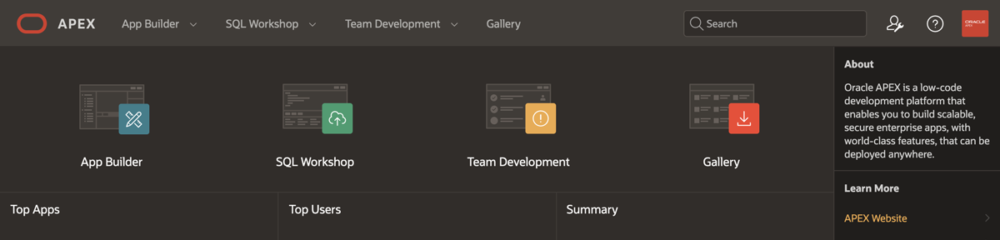

### ➡️ **Como o Oracle APEX revoluciona o desenvolvimento de aplicações no Oracle Database?**

> Com o Oracle APEX, desenvolvedores podem criar aplicações empresariais modernas por meio de uma interface intuitiva que combina design visual, componentes integrados e funcionalidades avançadas, como gráficos interativos, relatórios dinâmicos e dashboards. O APEX aproveita as capacidades nativas do Oracle Database, como segurança, alta disponibilidade e desempenho, permitindo a criação de workspaces, o upload de aplicações e a integração com serviços externos via credenciais e APIs. Com poucos cliques, é possível importar arquivos SQL, configurar parâmetros de segurança e realizar customizações rápidas e eficientes.

### **Recursos e Suporte**:
- **Download do PDF**: [Normas Internas Dataprev](https://www.dataprev.gov.br/governanca/normativos/normasinternas). Para o nosso exemplo, utilizaremos o arquivo **Viagem a Serviço Nacional**.
- **Documentação da Oracle Cloud**: [Getting started with vectors in 23ai](https://blogs.oracle.com/coretec/post/getting-started-with-vectors-in-23ai)
- **Tutoriais**: [Oracle Database 23ai - Oracle AI Vector Search & Retrieval Augmented Generation (RAG) with Oracle APEX](https://www.linkedin.com/pulse/oracle-database-23ai-ai-vector-search-retrieval-augmented-rao-bqkcf/)

## 1️⃣ Testar APEX

1. Para testar o APEX, entre no link a seguir:
[APEX do Laboratório finalizado](https://g51069da5907266-adwfasttrack.adb.sa-saopaulo-1.oraclecloudapps.com/ords/r/demo/demo/assistente-ai?session=212550394555216)
2. Execute as ações da Atividade 4 (atividade anterior).
3. Clique em Assistente AI e faça uma pergunta relacionada ao documento carregado. Por exemplo, você pode perguntar: **"COMO FAZER ALTERAÇÃO DE VIAGEM"**.

   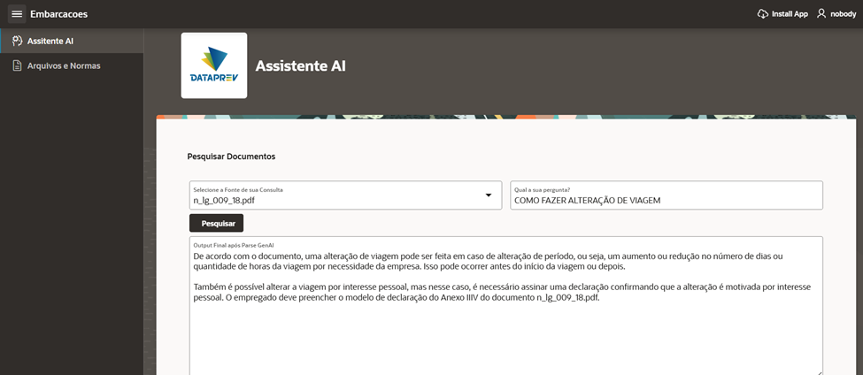

## 2️⃣ Criação de Workspace e Import de aplicação em ambiente APEX

**Para acessar a URL da instância APEX na Console do Oracle Cloud Infrastructure (OCI) siga os passos a seguir.**

Inicialmente, retorne ao console da OCI. Em seguida, navegue até a página do seu Autonomous Database. Dentro da página da instância do banco de dados, localize e clique na opção **"Tool Configuration"**. Lá, você encontrará a URL da instância APEX. **Copie essa URL e abra em seu navegador.**

   

Na página que será aberta ao acessar a URL da instância APEX, **insira a senha de acesso ao workspace admin**, criada na etapa anterior (**WORKSHOPsec2019##**).

   

Em seguida, clique na opção **Create Workspace**. Na tela seguinte, escolha a opção **Existing Schema** para continuar com a criação do workspace utilizando um schema já existente.

   

Na sequência, preencha o formulário como o exemplo abaixo (recomendamos a senha **WORKSHOPsec2019##**). E clique em **Create Workspace** para finalizar.

> **ATENÇÃO**: Verifique se utilizou a senha recomendada **WORKSHOPsec2019##**

   

Clique na aba superior **Manage Instance** e, em seguida, selecione **Security**.

   

Altere o parâmetro **Allow Public File Upload** para **Yes** e clique em **Apply Changes** para salvar as alterações.

   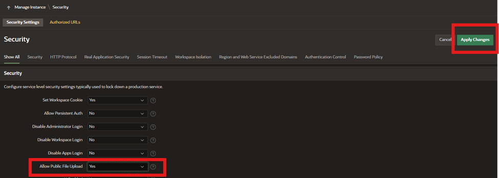

Encerre a sessão do usuário **ADMIN** clicando em **Sign Out**, localizado na região superior direita da tela.

   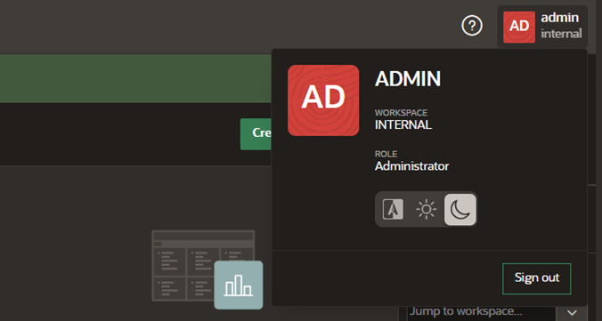

Faça o login no usuário **DEMO** criado nas etapas anteriores utilizando as credenciais de acesso indicadas abaixo.

> **ATENÇÃO**: Verifique se utilizou a senha recomendada **WORKSHOPsec2019##**

   

Clique em **App Builder** e, em seguida, selecione **Import**.

   

Na página que será aberta, faça o upload do arquivo **APEX\_FT\_SAO\_PAULO.sql** ou **APEX\_FT\_CHICAGO.sql** (Verifique a região do seu ambiente)

   

Clique em **Next:**

   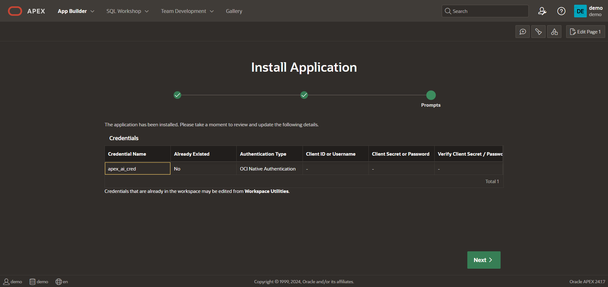

Aceite as configurações padrão e clique em **Install Application** para prosseguir com a instalação.

   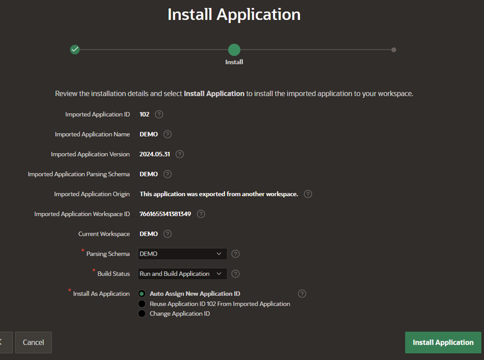

Clique em **Install Supporting Objects** para concluir a instalação dos objetos de suporte necessários.

   

Por fim, clique na aba **App Builder** para retornar à interface principal de desenvolvimento de aplicações.

   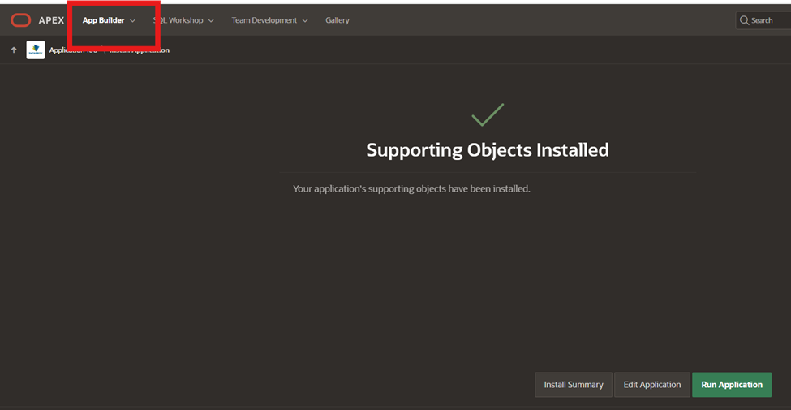

## 3️⃣Configuração de Credenciais para RAG (Retrieval-Augmented Generation)

Na aba **App Builder**, clique em **Workspace Utilities** para acessar as ferramentas utilitárias do workspace.

   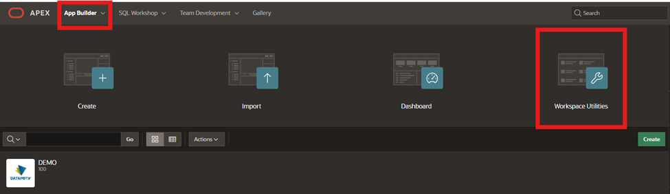

Em seguida, selecione **Web Credentials** e clique na credencial existente chamada **apex\_ai\_cred**.

   
   

Para preencher corretamente essa credencial, é necessário obter algumas informações sobre o usuário no ambiente OCI (https://cloud.oracle.com/). Na guia do navegador onde o OCI está aberto, clique no avatar no canto superior direito e selecione **User Settings**.
   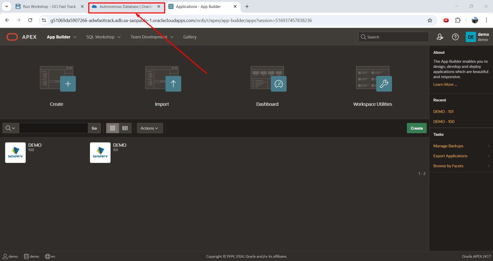
   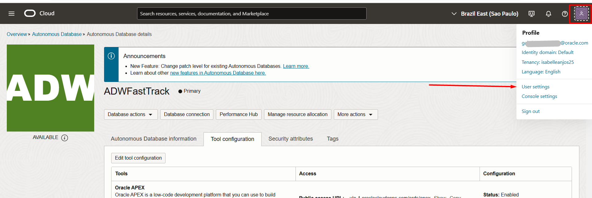

Na tela **User Settings**, localize a guia **API Keys** no canto inferior esquerdo. Clique nela e siga as instruções do assistente (wizard) para criar um par de chaves de API. 

> **ATENÇÃO: Certifique-se de fazer o download das chaves em um local seguro, pois será necessária para configurar a credencial na próxima etapa. Após o dowload, clique em ADD**
> 
   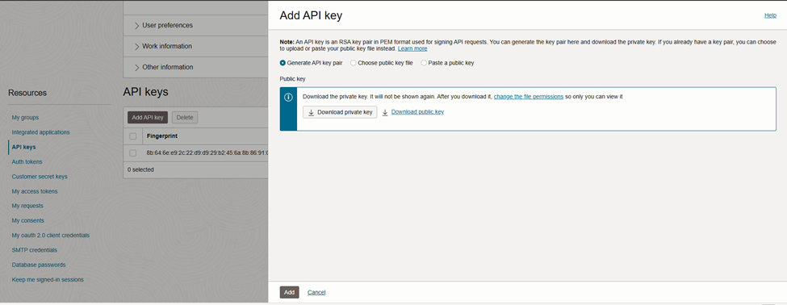

O preenchimento do formulário no APEX exigirá informações específicas que podem ser obtidas na tela do OCI. Para facilitar, **utilize as seguintes correspondências de cores** entre os dois sistemas. Preencha as seguintes informações:
- **OCI User ID** (Coletado no Configuration File Preview)
- **OCI Public Key Fingerprint** (Coletado no Configuration File Preview)
- **OCID Tenancy** (Coletado no Configuration File Preview)
- **OCI Private Key** (Abra o arquivo **.pem** cujo download foi realizado em um bloco de notas e copie o conteúdo)

Caso você tenha fechado a página com os dados, clique nos **três pontos** em **API Keys** ao lado direito do fingerprint e clique em **View Configuration File**

   
   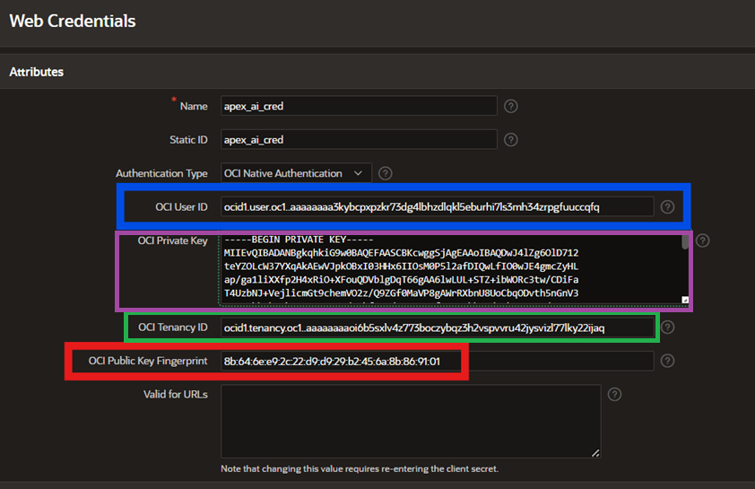

Por fim, clique em **Apply Changes** para salvar as configurações e concluir o ajuste da credencial.

## 4️⃣ Configuração no Payload da API de Requisição

Para concluir este processo, será necessário realizar uma alteração no **payload da API de requisição**.

Acesse o **App Builder** e clique na aplicação que você instalou recentemente.

   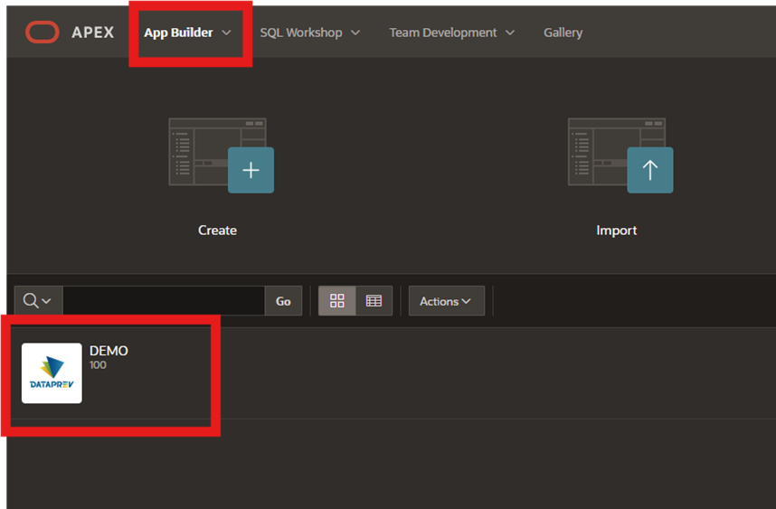

Selecione em **Shared Components ⮕ REST Data Resources**

   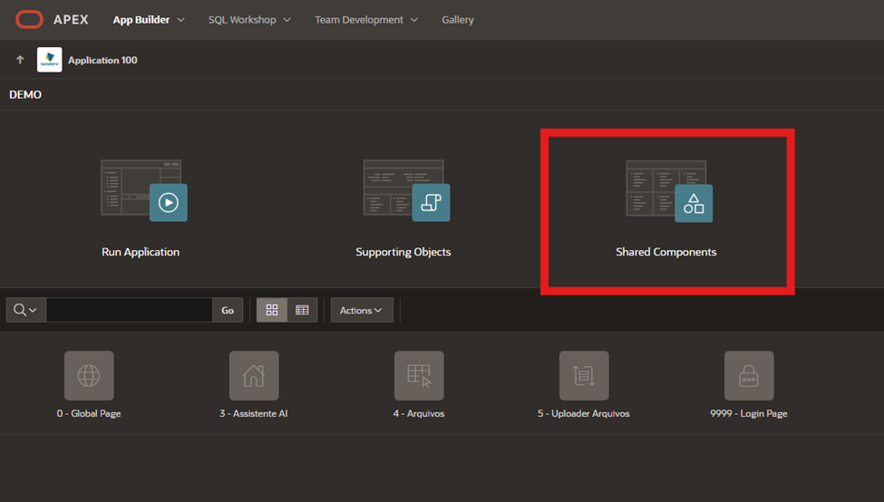
   

Clique em **cohere-chat** e, em seguida, no **ícone de lápis ao lado do método POST**.

   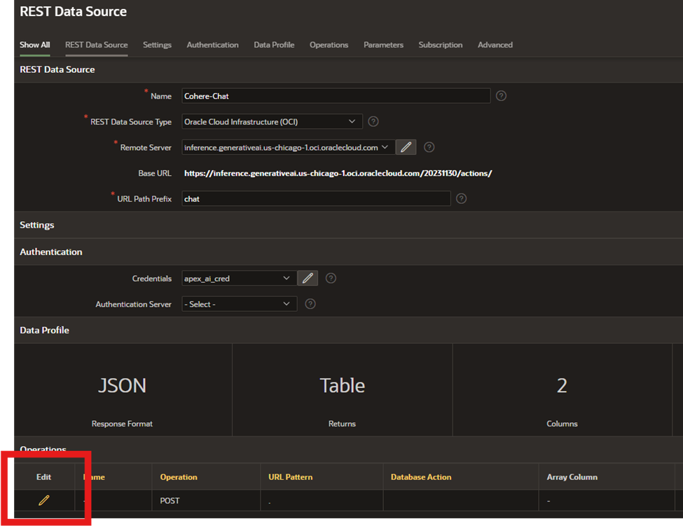

**Altere o Compartment ID para a variável OCI Tenancy ID coletada na etapa 2 deste laboratório.**
Por fim, clique em **Apply Changes** para salvar as alterações.

   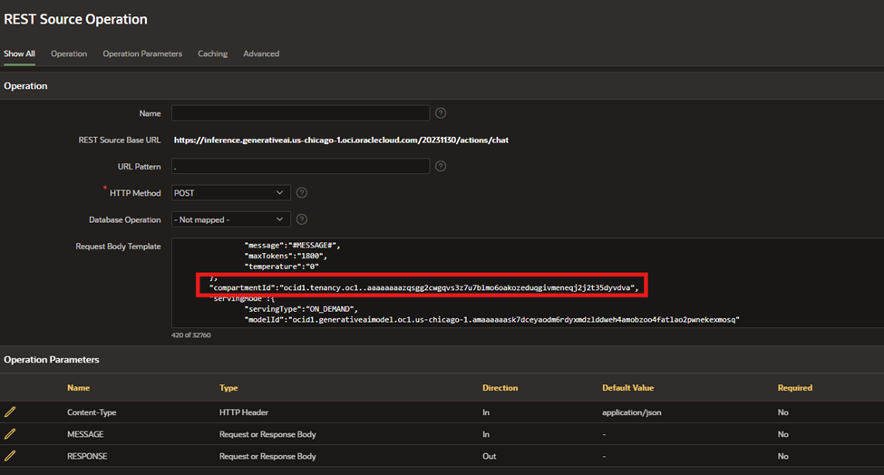

## 5️⃣ Teste da Aplicação

Com a configuração da credencial concluída, podemos testar a aplicação. Para isso, clique em **App Builder** e, em seguida, no ícone **Run** para executar a aplicação e verificar seu funcionamento.

   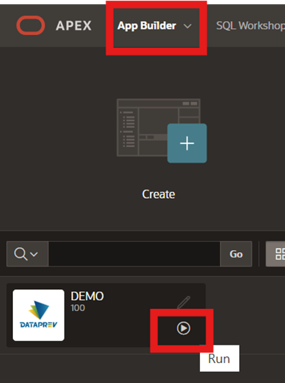

Clique no ícone **(☰)** e selecione a aba **Arquivos e Normas**.

   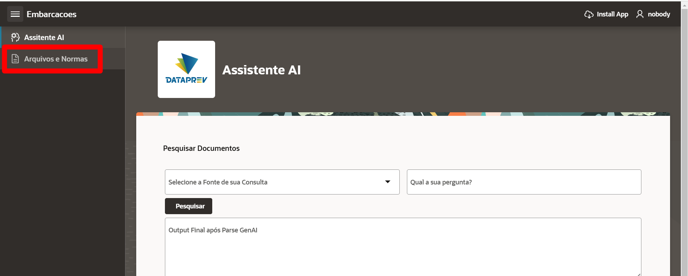

Seguiremos com o upload de um arquivo PDF para dentro da aplicação. **Qualquer PDF pode ser utilizado**, mas, para fins didáticos deste workshop, recomendamos as normas disponíveis no link: [Normas Internas Dataprev](https://www.dataprev.gov.br/governanca/normativos/normasinternas). Para o nosso exemplo, utilizaremos o arquivo **Viagem a Serviço Nacional**.

> **ATENÇÃO:** O documento PDF também está disponível no arquivo zip [ARQUIVOS-FAST-TRACK](https://objectstorage.sa-saopaulo-1.oraclecloud.com/p/guSkIEAu7sNEmxLxVPtgxffzgNeKgGOmWylItTi_pFlC82yg7qEL9khYHAMomQ_m/n/gr22x2xy27fx/b/bucket-arquivos-dataprev/o/ARQUIVOS_FAST_TRACK.zip)

   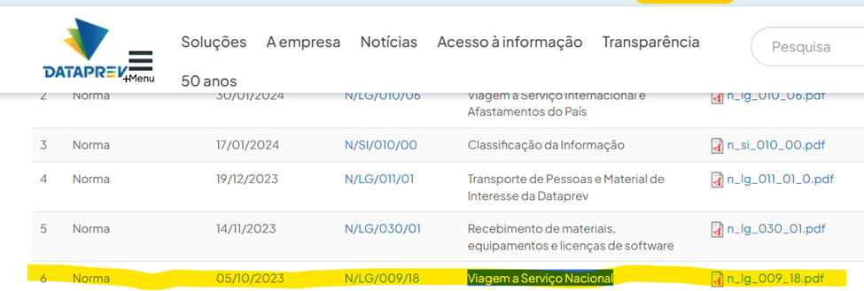

Clique em **Upload** e preencha o formulário seguindo o exemplo fornecido. O **JSON** utilizado para o preenchimento está disponível logo abaixo da imagem de referência.

   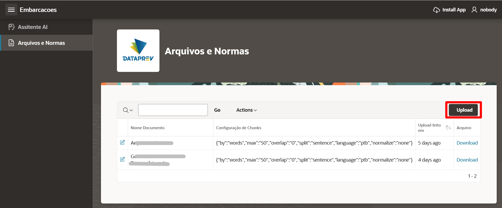
   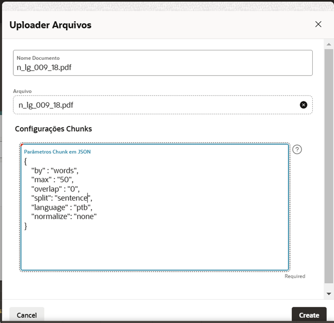

    <copy>  
    {
        "by" : "words",
        "max" : "50",
        "overlap" : "0",
        "split": "sentence",
        "language" : "ptb",
        "normalize": "none"
    }

    </copy>

Se o upload for concluído com sucesso, sua tela deverá se assemelhar ao exemplo exibido, mostrando a confirmação do arquivo enviado e os detalhes preenchidos no formulário.

   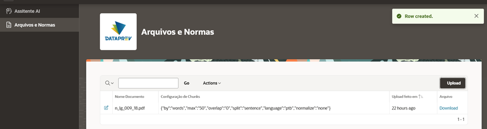

Clique em Assistente AI e faça uma pergunta relacionada ao documento carregado. Por exemplo, você pode perguntar: **"COMO FAZER UMA ALTERAÇÃO DE VIAGEM?"**.

   

**Se não houver erro, você terá concluído com sucesso o workshop.** Sinta-se à vontade para fazer o upload de outros arquivos ou explorar realizando novas perguntas ao Assistente AI.

## 👥 Agradecimentos

- **Autores** - Caio Oliveira
- **Autores Contribuintes** - Isabelle Anjos, Gabriela Miyazima, Aristotelles Serra
- **Última Atualização Por/Data** - Janeiro 2025

## 🛡️ Declaração de Porto Seguro (Safe Harbor)

O tutorial apresentado tem como objetivo traçar a orientação dos nossos produtos em geral. É destinado somente a fins informativos e não pode ser incorporado a um contrato. Ele não representa um compromisso de entrega de qualquer tipo de material, código ou funcionalidade e não deve ser considerado em decisões de compra. O desenvolvimento, a liberação, a data de disponibilidade e a precificação de quaisquer funcionalidades ou recursos descritos para produtos da Oracle estão sujeitos a mudanças e são de critério exclusivo da Oracle Corporation.

Esta é a tradução de uma apresentação em inglês preparada para a sede da Oracle nos Estados Unidos. A tradução é realizada como cortesia e não está isenta de erros. Os recursos e funcionalidades podem não estar disponíveis em todos os países e idiomas. Caso tenha dúvidas, entre em contato com o representante de vendas da Oracle. 