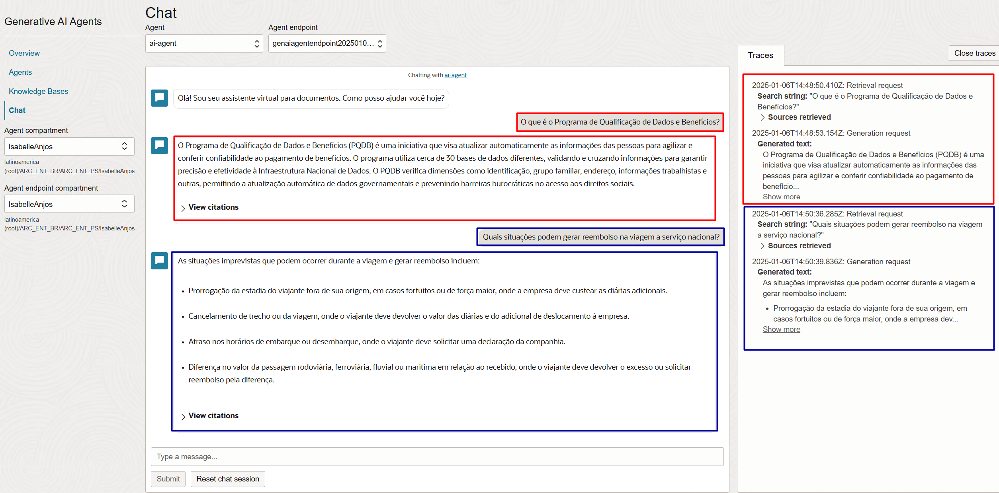
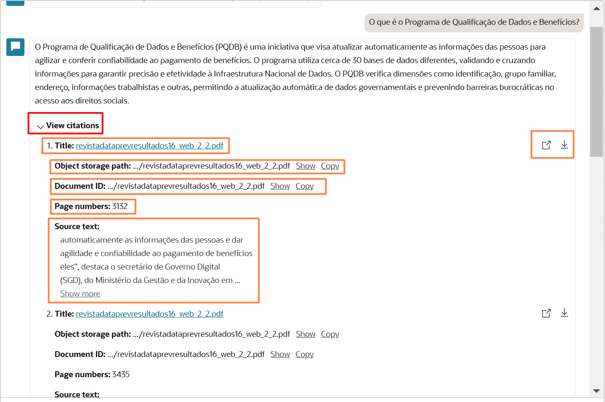
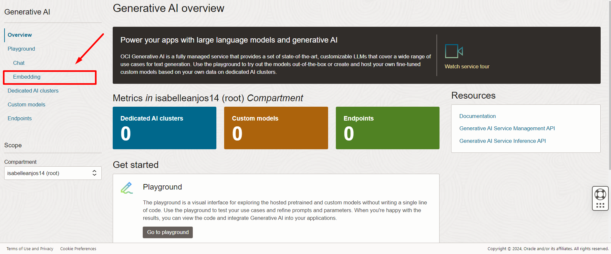

# Oracle Generative AI Agents

## 📌 Introdução

>**O OCI Generative AI Agents é um serviço avançado que combina o poder dos grandes modelos de linguagem (LLMs) com técnicas de recuperação inteligente, permitindo que organizações desenvolvam agentes virtuais capazes de fornecer respostas contextuais e precisas ao consultar suas bases de conhecimento.** 

Referência: [Generative AI Agents](https://www.oracle.com/br/artificial-intelligence/generative-ai/agents/)

### ➡️ **Recursos principais**
Com funcionalidades avançadas, o OCI Generative AI Agents oferece uma experiência poderosa e eficiente.
- **Integração de dados e canais de interação:** Suporte a chat e API, facilitando a interação entre usuários e agentes.  
- **Respostas contextualmente relevantes:** As respostas são geradas com base em consultas inteligentes à base de conhecimento, garantindo precisão e contexto.  
- **Pesquisa híbrida:** Combina métodos léxicos e semânticos para alcançar maior assertividade nas respostas.  
- **Moderação de conteúdo:** Garante interações seguras e respeitosas com controles para entrada e saída de dados.  
- **Conversas multi-turn:** Permite que usuários façam perguntas de acompanhamento, com respostas que levam em conta o histórico da conversa.  
- **Interpretação de elementos visuais:** Capacidade de interpretar gráficos e tabelas em PDFs sem necessidade de descrições adicionais.  
- **Hiperlinks automáticos:** Os links presentes nos documentos são automaticamente extraídos e incluídos nas respostas.  

### ➡️ **Como o OCI Generative AI Agents revoluciona a interação com bases de conhecimento?**

O serviço transforma a forma como os agentes interagem ao:  

- **Aumentar a transparência e a rastreabilidade:** Cada resposta pode ser vinculada à sua fonte original, garantindo responsabilidade.  
- **Garantir atualizações contínuas:** Bases de conhecimento podem ser atualizadas sem interromper o funcionamento do agente.  
- **Oferecer escalabilidade e segurança:** Arquitetura robusta que suporta cargas crescentes sem comprometer a integridade dos dados.

 

### 📌 **Objetivos**

Descubrir como utilizar de forma prática a funcionalidade de busca vetorial do Oracle Generative AI Agents para otimizar consultas em documentos no formato PDF.

O que você aprenderá:

- Criar buckets no Object Storage e realizar o upload de documentos PDF.
- Configurar e utilizar o serviço OCI Generative AI Agent para criar bases de conhecimento e agentes conversacionais.
- Explorar como implementar a funcionalidade de Retrieval-Augmented Generation (RAG) para consultar documentos personalizados com eficiência e contexto.

 
### **Recursos e Suporte**:

- **Download dos PDFs**: Neste laboratório utilizaremos dois documentos:
     - [Normas Internas Dataprev](https://www.dataprev.gov.br/governanca/normativos/normasinternas): Para o nosso exemplo, utilizaremos o arquivo **Viagem a Serviço Nacional**.
     - [Revista Dataprev Resultados nº 16](https://www.dataprev.gov.br/acompanhe-dataprev-publicacoes/revista-dataprev-resultados): Para o nosso exemplo, utilizaremos o arquivo **Revista Dataprev Resultados nº 16**.

- **Documentação da Oracle Cloud**: [Generative AI Agents](https://docs.oracle.com/pt-br/iaas/Content/generative-ai-agents/home.htm)
- **Tutoriais**: [Deploy an ODA Chatbot powered by Generative AI Agents](https://apexapps.oracle.com/pls/apex/f?p=133:180:2908048658105::::wid:4022)

### _**Aproveite sua experiência na Oracle Cloud!**_

## 1️⃣ Interface de Interação com o Assistente Virtual

### **Agente e Endpoint (destacado em azul)**

> - **Agent:** Neste campo você seleciona o agente configurado para responder às suas perguntas. No exemplo, o agente selecionado é o **ai-agent**.
>  
> - **Agent Endpoint:** O endpoint associado ao agente. Este é o ponto de acesso que conecta o assistente às bases de conhecimento.

### **Área de Chat (destacada em vermelho)**

Esta é a área principal onde você pode interagir com o agente. Aqui, o assistente exibe a mensagem de saudação que configuramos e as respostas às suas perguntas.

> -  O campo **Type a message...** é onde você insere suas perguntas. Após digitar, clique em **Submit** para enviar a mensagem.
> -  O botão **Reset chat session** permite reiniciar a sessão de chat, apagando o histórico atual de interação.

### **Traces (destacado em laranja)**

> O painel Traces mostra detalhes técnicos de cada interação com o agente, como as **consultas realizadas, os resultados gerados e os detalhes da página e parágrafo cujas informações foram obtidas**. Este recurso é útil para analisar como o assistente processa as perguntas e recupera informações da base de conhecimento.

Na imagem abaixo, você pode observar o funcionamento do assistente virtual ao responder perguntas baseadas em diferentes documentos previamente carregados na base de conhecimento.

1. A pergunta **"O que é o Programa de Qualificação de Dados e Benefícios?"** foi realizada com base em um documento específico presente na base de conhecimento.
2. Outra pergunta foi realizada: **"Quais situações podem gerar reembolso na viagem a serviço nacional?"**, utilizando informações de um documento diferente da mesma base de conhecimento.

Exemplos de perguntas para os documentos utilizados:

> ### **Revista Dataprev**
> 1. Qual é o objetivo principal da Dataprev nos seus 50 anos de atuação?
> 2. O que é a Infraestrutura Nacional de Dados (IND)?
> 3. Quais foram os avanços tecnológicos destacados pela Dataprev?
> 4. Como a Dataprev contribui para a soberania digital do Brasil?
> ### **Normas internas**
> 1. Quem está sujeito à aplicação da norma de Viagem a Serviço Nacional?
> 2. O que é o adicional de deslocamento de embarque e desembarque?
> 3. Quais tipos de alteração de viagem são previstos?
> 4. O que é a Proposta de Concessão de Diárias e Passagens (PCDP)?
> 5. Qual o prazo para prestação de contas após a viagem?
> 6. Quais são os valores estabelecidos para diárias e deslocamentos?

Ao clicar em **View Citations**, você expande as referências utilizadas pelo assistente para gerar a resposta. Os **ícones** à esquerda permitem abrir o documento em outra aba do navegador ou fazer o download do arquivo, respectivamente 

Cada citação apresenta as seguintes informações:

> - **Title:** O nome do arquivo PDF de onde a informação foi extraída (neste exemplo, revistadataprevresultados16_web_2_2.pdf).
> - **Object storage path:** O caminho do arquivo no armazenamento do OCI.
> - **Document ID:** Um identificador único do documento.
> - **Page numbers:** Indica o número da página no documento de onde a informação foi retirada.
> - **Source text:** Exibe o trecho exato do documento utilizado para compor a resposta do assistente.

Laboratório finalizado! Parabéns por concluir todas as etapas. Fique à vontade para criar novas perguntas, explorar a sua aplicação e descobrir ainda mais possibilidades com o seu assistente virtual.

Você poderá seguir para o próximo laboratório.

## 2️⃣ [EXTRA] Embeddings com OCI Generative AI

### ❓**O que são Embeddings?**
> Embeddings são representações vetoriais de objetos, como textos ou imagens. **Ao transformar objetos em vetores, conseguimos realizar operações matemáticas que permitem comparar, analisar e calcular a similaridade entre eles.** Isso possibilita, por exemplo, identificar semelhanças entre textos ou buscar informações relevantes de forma eficaz.

### 🔍 **Por que Embeddings são importantes?**
>   - **Análise de Similaridade:** Com embeddings, podemos calcular a proximidade entre diferentes objetos, facilitando a identificação de itens semelhantes.
>    - **Eficiência Computacional:** Representar dados em vetores torna o processamento de informações mais rápido e eficiente.
>    - **Versatilidade:** Embeddings podem ser usados em vários contextos, como busca de informações, recomendação de conteúdo, entre outros.

Vamos acessar o Serviço de OCI Generative AI. A forma mais simples de fazer isto é pesquisando por
**“Generative AI”** na aba de busca:

   

Uma vez dentro do serviço, vamos selecionar **“Embedding”**, no menu do canto esquerdo, abaixo de **“Playground”**.

   

Dentro do PlayGround, vamos na caixa de seleção “model” e vamos selecionar o modelo **cohere.embed-multilingual-v3**, em seguida, adicione as frases abaixo nas caixas brancas disponíveis. Não é necessário que estejam em ordem:

    <copy>
    Cachorros são animais incríveis.
    </copy>
<!-- Separador -->

    <copy>  
    Eu amo cães, são fantásticos.  
    </copy>  
<!-- Separador -->

    <copy>  
    Cachorros adoram brincar ao ar livre e correr pelo parque.  
    </copy>  
<!-- Separador -->

    <copy>  
    Os gatos são animais elegantes e misteriosos.  
    </copy>  
<!-- Separador -->

    <copy>  
    Gatos são mestres em encontrar os melhores lugares para dormir.  
    </copy>  
<!-- Separador -->

    <copy>  
    Gatos têm uma habilidade incrível de se espremer em espaços pequenos.  
    </copy>  
<!-- Separador -->

    <copy>  
    A Porsche faz carros belíssimos.  
    </copy>  
<!-- Separador -->

    <copy>  
    A Ferrari é conhecida por seus carros velozes.  
    </copy>  
<!-- Separador -->

    <copy>  
    Carros esportivos são feitos para quem busca emoção na estrada.  
    </copy>  
<!-- Separador -->

    <copy>  
    Gatos gostam de se esconder nos carros esportivos, como em uma Ferrari.  
    </copy>  
<!-- Separador -->

    <copy>  
    Cachorros adoram aproveitar o vento enquanto passeiam em carros conversíveis, como um Porsche.  
    </copy>  

Em seguida, clique em **Run**.

> **Os vetores de embeddings costumam ter muitas dimensões (em geral, entre 512 e 1024 dimensões). Como é impossível visualizar graficamente algo com tantas dimensões, o que costuma ser feito é uma “Projeção” destes vetores multidimensionais em superfícies bidimensionais, permitindo a visualização.**

A proximidade entre os vetores no gráfico representa a **similaridade semântica entre as frases.** Quanto mais próximos dois pontos estão, mais semelhantes são as frases em termos de conteúdo e contexto, de acordo com o modelo de embedding.

Por exemplo:
   - **Vetores 1, 2, 3, 4, 5 e 6:** As frases sobre características e comportamentos de gatos e cachorros estão agrupadas, refletindo similaridades relacionadas aos animais e suas ações típicas.
   - **Vetores 7, 8 e 9:** As frases que mencionam carros esportivos e marcas como Ferrari e Porsche estão próximas entre si, já que compartilham temas de automóveis e experiências de direção.
   - **Vetores 10 e 11:** As frases sobre "gato e Ferrari" e "cachorro e Porsche" estão próximas entre si e dos clusters de carros de luxo, pois combinam comportamentos de animais de estimação com automóveis, unindo ambos os temas.

## 👥 Agradecimentos

- **Autores** - Isabelle Anjos
- **Autores Contribuintes** - Caio Oliveira, Gabriela Miyazima, Aristotelles Serra
- **Última Atualização Por/Data** - Janeiro 2025

## 🛡️ Declaração de Porto Seguro (Safe Harbor)

O tutorial apresentado tem como objetivo traçar a orientação dos nossos produtos em geral. É destinado somente a fins informativos e não pode ser incorporado a um contrato. Ele não representa um compromisso de entrega de qualquer tipo de material, código ou funcionalidade e não deve ser considerado em decisões de compra. O desenvolvimento, a liberação, a data de disponibilidade e a precificação de quaisquer funcionalidades ou recursos descritos para produtos da Oracle estão sujeitos a mudanças e são de critério exclusivo da Oracle Corporation.

Esta é a tradução de uma apresentação em inglês preparada para a sede da Oracle nos Estados Unidos. A tradução é realizada como cortesia e não está isenta de erros. Os recursos e funcionalidades podem não estar disponíveis em todos os países e idiomas. Caso tenha dúvidas, entre em contato com o representante de vendas da Oracle. 
