## Oracle Cloud Data Science

# 🎯 **Objetivos**

Utilizar **OCI Data Science** e a **API do OCI Generative AI** para extrair informações de documentos em **Python**, aproveitando o poder do modelo **LLAMA 3.2 90B**, que analisa **texto e imagens**.  

🔹 **O que você aprenderá:**  
- Criar **notebook no OCI Data Science** e carregar os documentos.  
- Desenvolver código em **Python** para interagir com a **API do OCI Generative AI**.  
- Implementar **RAG (Retrieval-Augmented Generation)** para consultas inteligentes em documentos.  
- Explorar o **LLAMA 3.2 90B** para análise avançada de texto e imagens.  

# ⚠️ **ATENÇÃO**:

**Download do arquivo ZIP:** [ARQUIVOS-FAST-TRACK](https://objectstorage.sa-saopaulo-1.oraclecloud.com/p/guSkIEAu7sNEmxLxVPtgxffzgNeKgGOmWylItTi_pFlC82yg7qEL9khYHAMomQ_m/n/gr22x2xy27fx/b/bucket-arquivos-dataprev/o/ARQUIVOS_FAST_TRACK.zip)
<br>
<br>
Arquivos utilizados neste laboratório:
  - Jupyter Notebook **FASTRACK\_AI\_DOCUMENTOS.ipynb**
  - Documentos anonimizados **(rg\_aberto.jpg, cnh\_aberta,jpg, etc)**

### _**Aproveite sua experiência na Oracle Cloud!**_

## 📌 Introdução

>O OCI Data Science é uma plataforma gerenciada para cientistas de dados criarem, treinarem e implantarem modelos de **ML** com Python e ferramentas open source. Com **JupyterLab**, GPUs **NVIDIA** e **treinamento distribuído**, acelere seus experimentos e escale modelos. Leve para produção com **MLOps**, automação e monitoramento inteligente. 🚀 

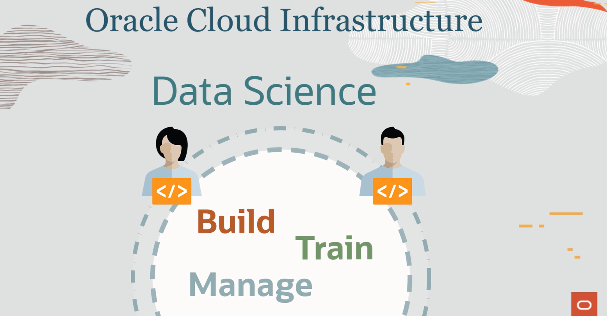

### ➡️ **Principais Recursos do OCI Data Science**  

#### 📊 **Preparação e Acesso a Dados**  
- **Acesso flexível**: Conecte-se a qualquer fonte de dados, em qualquer nuvem ou on-premises.  
- **Rotulagem de dados**: Use o OCI Data Labeling para criar conjuntos de dados rotulados para IA/ML.  
- **Processamento escalável**: Execute consultas **Spark** no **OCI Data Flow** com o SDK do **ADS**.  
- **Loja de recursos (preview)**: Gerencie pipelines de engenharia de recursos, versionamento e compartilhamento.  

#### 🤖 **Criação e Treinamento de Modelos**  
- **Interface JupyterLab**: Ambientes de notebook integrados e hospedados na nuvem.  
- **ML Open Source**: Suporte para TensorFlow, PyTorch e centenas de outras ferramentas.  
- **Oracle ADS SDK**: Kit de ferramentas Python para todo o fluxo de trabalho de ciência de dados.  
- **Treinamento com GPUs**: NVIDIA GPUs aceleram deep learning em até 10x.  
- **Execução em lote**: Use **Jobs** para tarefas repetitivas, com suporte a GPUs e treinamento distribuído.  

#### 🔍 **Gerenciamento e Governança de Modelos**  
- **Catálogo de Modelos**: Preserve e compartilhe modelos com artefatos e metadados completos.  
- **Avaliação de Modelos**: Compare e monitore o desempenho dos modelos automaticamente.  
- **Ambientes Repetíveis**: Conda pré-configurado para NLP, visão computacional, previsão, etc.  
- **Controle de Versão**: Integração com Git para rastrear código e experimentos.  

#### 🚀 **Automação e MLOps**  
- **Deploy Gerenciado**: Implante modelos como **endpoints HTTP** em tempo real com um clique.  
- **Pipelines de ML**: Automatize fluxos de treinamento e implementação com rastreamento e gestão.  
- **Monitoramento Contínuo**: Detecte desvios de conceito e receba alertas para retreinamento.  

#### 🔥 **AI Quick Actions e LLMs**  
- **Acesso sem código**: Utilize **LLMs da Mistral, Meta** e outros via interface gráfica.  
- **Ajuste de modelos**: Treine com **PyTorch, Hugging Face Accelerate ou DeepSpeed**.  
- **Deploy otimizado**: Implemente via **vLLM, Text Generation Inference ou TensorRT-LLM**.  
- **Avaliação de LLMs**: Gere relatórios automáticos de métricas como **BERTScore e ROUGE**.  

> **Tudo isso no OCI Data Science: escalável, seguro e integrado!** 🚀

### **Recursos e Suporte**:
- **Documentação da Oracle Cloud**: [OCI Data Science](https://docs.oracle.com/en-us/iaas/data-science/using/home.htm)

## 1️⃣ Acesso ao notebook OCI Data Science

 Clique no menu **(☰)** e selecione **Analytics & AI ⮕ Data Science**

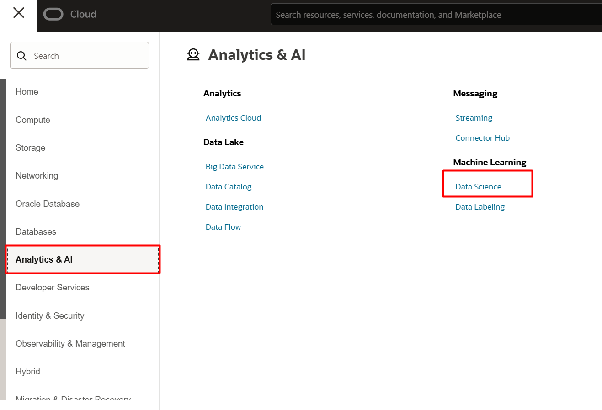

Clique no projeto criado anteriormente. Em segudia, clique no nome do Notebook Session, como indicado abaixo. 

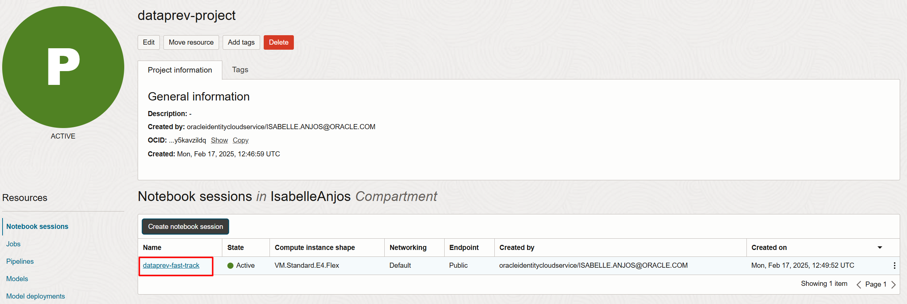

O Notebook Session deve estar **Ativo**. Clique em **Open**

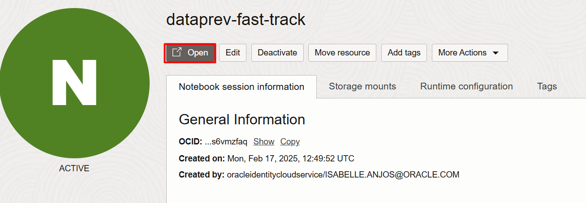


## 2️⃣ Configuração notebook OCI Data Science

Vamos configurar o ambiente virtual que será utilizado para processamento do código.
Ao acessar o ambiente do Data Science, clique em **Extend Session** na região superior direita, e em seguida, clique em **Environment Explorer**, localizado no centro da tela.

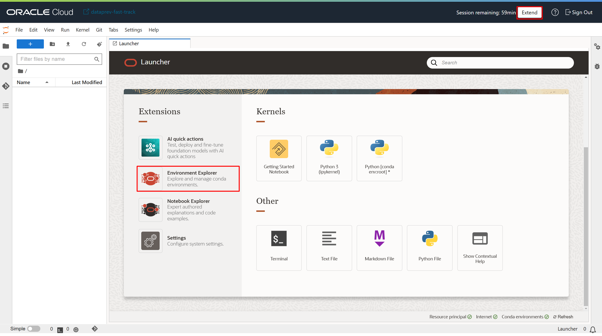

Após abrir o Environment Explorer, busque o ambiente com nome ``Oracle AutoMLx v23.4 for CPU on Python 3.10``. Clique nos três pontos na região direita, e **Install**. Aguarde a mensagem indicada na imagem abaixo.

>**ATENÇÃO:** Se atente para selecionar a versão do Python 3.10.

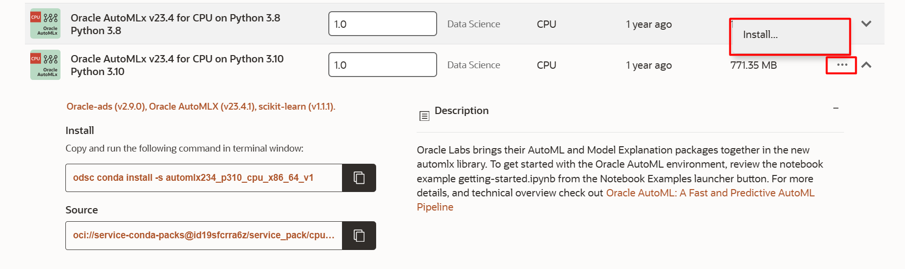

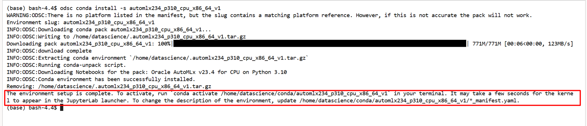

> **SOMENTE no caso do terminal não ter sido aberto no momento da instalação, selecione File ⮕ New ⮕ Terminal no menu localizado na região esquerda superior da tela.**
>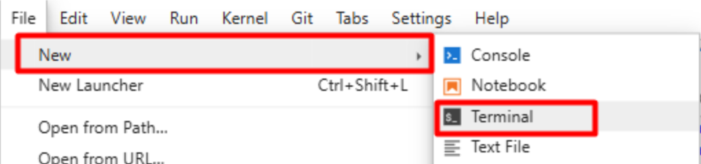

Com o terminal aberto, cole o código abaixo para buscar o caminho do conda environment que será ativado.

    <copy>  
    conda env list
    </copy>  
<!-- Separador -->

Copie o caminho indicado acima, substitua o caminho no código abaixo e utilize no código no terminal.

    <copy>  
    conda activate <caminho-do-ambiente>  
    </copy>  
<!-- Separador -->

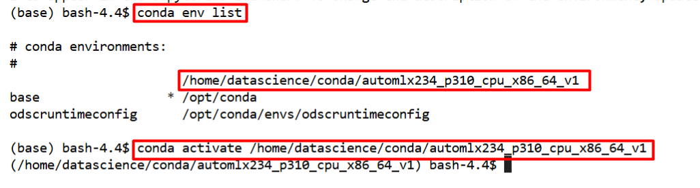

Assim que o ambiente estiver ativo, executar os seguintes comandos no terminal **(copie o código, cole no terminal e clique Enter)**:

    <copy>  
    pip install PyMuPDF
    pip install --upgrade oci 
    </copy>  
<!-- Separador -->

## 3️⃣ Seleção do ambiente Conda no Notebook

Faça o download dos documentos que serão utilizados neste laboratório. Neste laboratório utilizaremos documentos de identificação anonimizados.

-  [ARQUIVOS-FAST-TRACK](https://objectstorage.sa-saopaulo-1.oraclecloud.com/p/guSkIEAu7sNEmxLxVPtgxffzgNeKgGOmWylItTi_pFlC82yg7qEL9khYHAMomQ_m/n/gr22x2xy27fx/b/bucket-arquivos-dataprev/o/ARQUIVOS_FAST_TRACK.zip)

Descompacte o arquivo em sua máquina. 

Localize o arquivo **FASTRACK\_AI\_DOCUMENTOS.ipynb**, **arraste e solte** o arquivo até o ambiente de organização de arquivos no Data Science.

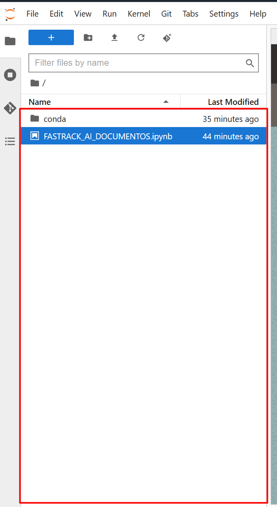

Na região superior esquerda, selecione o ícone seguinte para criação de uma pasta para armazenamento dos documentos. Em seguida, clique com o botão direito na pasta e selecione **Rename**. Coloque o nome da pasta de **DOCUMENTOS**.

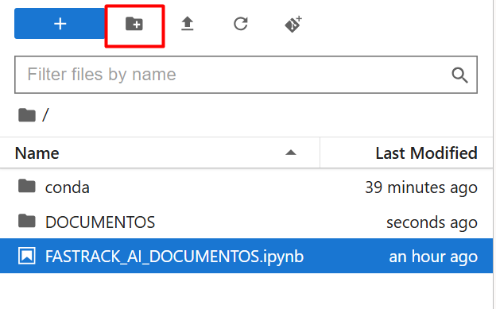

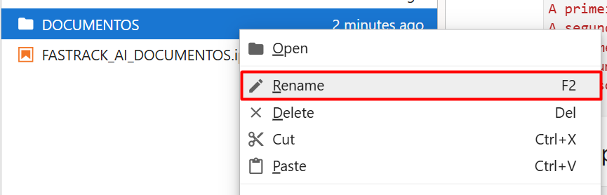

Abra a pasta. Localize os 4 arquivos indicados na imagem e arraste para dentro da pasta criada anteriormente.

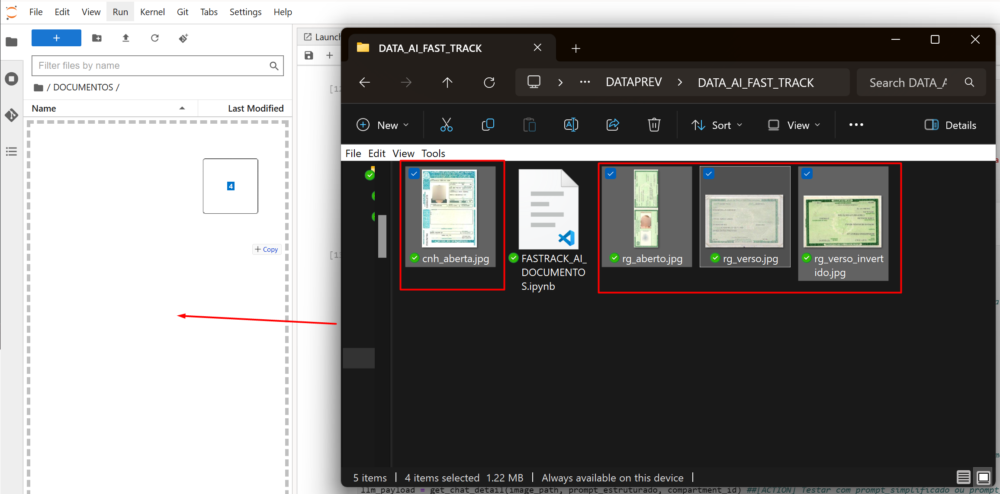

Clique no ícone da pasta ao lado do nome DOCUMENTOS para retornar à pasta inicial.

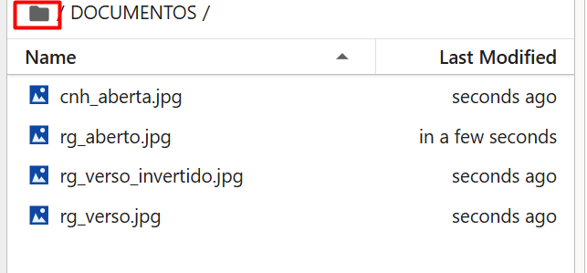

Clique **duas vezes** no notebook e selecione o kernel correto na região direita superior, como indicado na imagem:
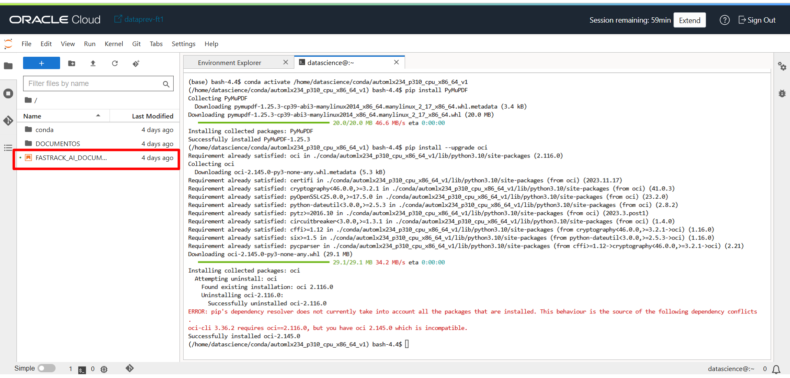
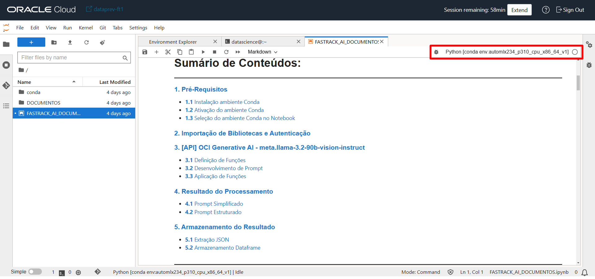
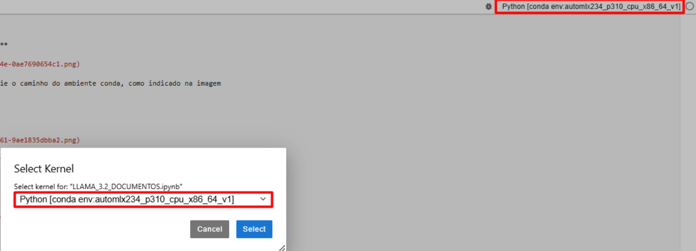

## 4️⃣ Processamento do código Notebook OCI Data Science

Com as etapas anteriores concluídas, siga para a etapa 2 do código aberto. **Execute os códigos seguintes através do ícone ▶️ indicado na imagem.**

> **ATENÇÃO:** É de EXTREMA importância verificar os indicadores de **[ACTION]** na etapa 3.3 do código e ajustar se necessário. Caso esteja na região de São Paulo, ajuste a variável **llm\_service\_endpoint** para **https://inference.generativeai.sa-saopaulo-1.oci.oraclecloud.com**

<br>

>### *Explicação:*
><br>
>    1. **Importação de bibliotecas**:  
>       - Bibliotecas padrão do Python como `os`, `requests`, `json`, `re`, `base64`, `pandas`
>       - `fitz` (PyMuPDF) para manipulação de PDFs.  
>       - `oci.generative_ai_inference` para interagir com o serviço de IA generativa da OCI.  
>       - `ads` (Accelerated Data Science) para autenticação.
>    2. **Autenticação na OCI**:  
>       - Utiliza `ads.set_auth("resource_principal")`, indicando que está rodando dentro de um ambiente da OCI que suporta autenticação via Resource Principal.  
>    

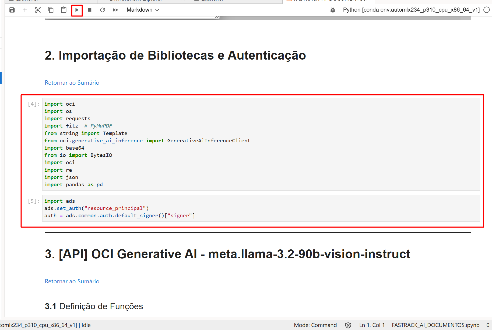

Nesta etapa, iremos definir as funções utilizadas em nosso código.

>### *Explicação:*
><br>
>   1. **Codificação de Imagem (`encode_image_to_base64(image_path)`)**:  
>       - A função `encode_image_to_base64(image_path)` converte uma **imagem JPG** em **Base64**, permitindo que seja enviada ao modelo de IA.
>   2. **Criação de Mensagem para o Modelo (`get_message`)**:  
>       - A função `get_message(image_path, prompt)` gera uma **mensagem formatada** contendo um **texto** e uma **imagem em Base64**.  
>       - Utiliza classes do `oci.generative_ai_inference.models`, como `TextContent`, `ImageContent`, `ImageUrl` e `UserMessage`.  
>       - A imagem é transformada em um **Data URL** (`data:image/jpeg;base64,...`) antes de ser adicionada à mensagem.

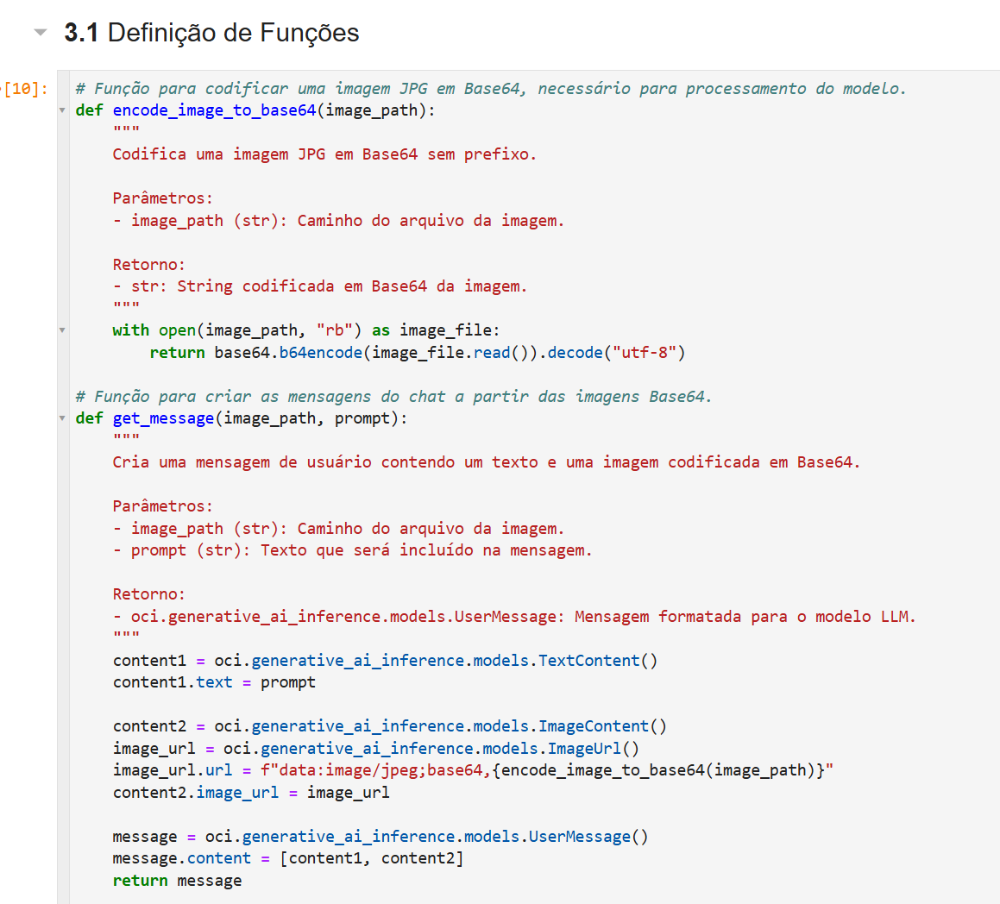

>### *Explicação:*
><br>
>   1. **Criação da Requisição de Chat (`get_chat_request`)**:  
>       - Gera uma **requisição** contendo um **texto** e uma **imagem codificada em Base64**.  
>       - Configura parâmetros do modelo:  
>           - `max_tokens = 500` (limite de tokens na resposta).  
>           - `temperature = 0` (respostas determinísticas).  
>           - `top_p = 0.3` (amostragem controlada).  
>       - Usa `GenericChatRequest` para estruturar a requisição.
>   2. **Detalhamento da Requisição (`get_chat_detail`)**:  
>       - Adiciona o **modelo de IA** (`meta.llama-3.2-90b-vision-instruct`).  
>       - Define o **compartimento da OCI** (`compartment_id`).  
>       - Utiliza `OnDemandServingMode` para especificar o modelo a ser usado na inferência.


>### *Explicação:*
><br>
>   1. **Desenvolvimento do Prompt**:  
>       - Define dois **prompts**:  
>           - `prompt_simplificado`: Solicita apenas a descrição do conteúdo da imagem.  
>           - `prompt_estruturado`: Instrui o modelo a extrair e estruturar dados em **JSON** com informações específicas de documentos.
>   2. **Aplicação de Funções**:  
>       - **Autenticação**: Obtém um **signer** via `oci.auth.signers.get_resource_principals_signer()`.  
>       - **Configuração do Endpoint**: Define `llm_service_endpoint`, que deve ser ajustado conforme a **região da OCI**.  
>       - **Definição de Parâmetros**:  
>           - `compartment_id`: Obtido das variáveis de ambiente da OCI.  
>           - `image_path`: Caminho da imagem a ser processada.  
>       - **Execução da Requisição**:  
>           - `llm_payload = get_chat_detail(image_path, prompt_estruturado, compartment_id)`.  
>           - Chama `llm_client.chat(llm_payload)`, enviando a requisição para o modelo.  
>           - Armazena a resposta extraída da **IA generativa**.

Nesta etapa, iremos executar as funções criadas em nosso código. 

> **ATENÇÃO:** É de EXTREMA importância verificar os indicadores de **[ACTION]** nesta etapa do código e ajustar se necessário. Caso esteja na região de São Paulo, ajuste a variável **llm\_service\_endpoint** para **https://inference.generativeai.sa-saopaulo-1.oci.oraclecloud.com**

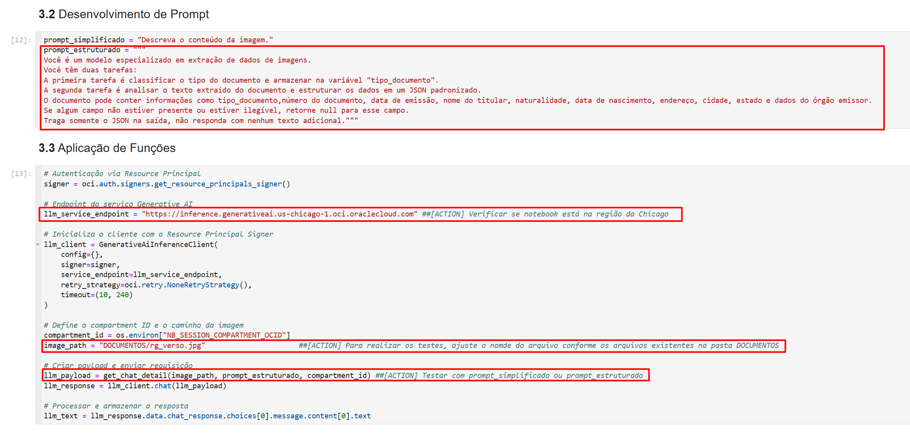

Analise os resultados do processamento. O primeiro indica o resultado do teste através do prompt simplificado e o segundo, através do prompt estruturado.

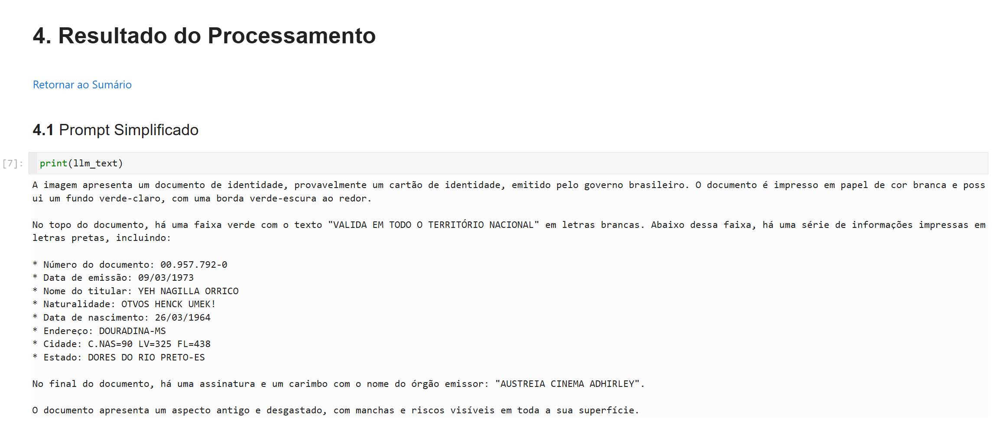
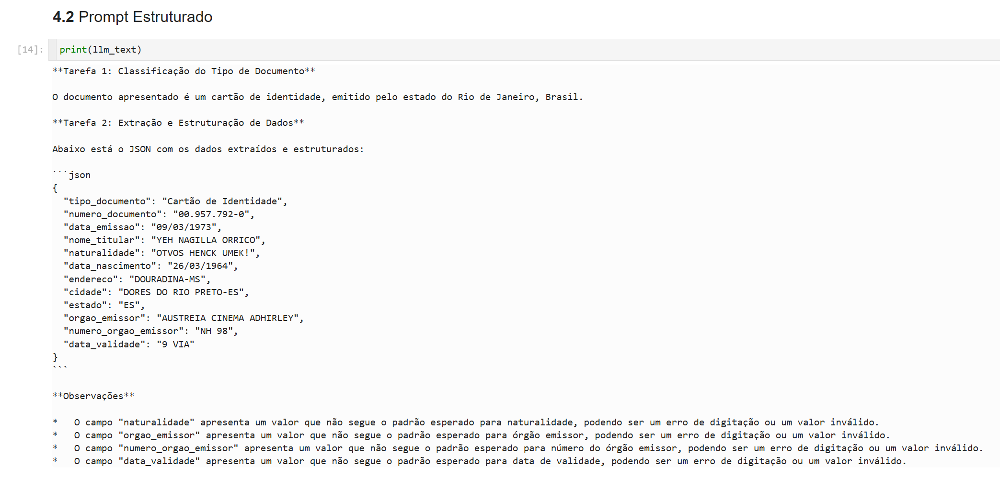

>### *Explicação:*
><br>
>   1. **Função `extract_json_from_text(text)`**:  
>       - Procura um **bloco de código Markdown** delimitado por ```json ... ``` ou ``` ... ```.  
>       - Busca extrair um **JSON válido** e convertê-lo em um **dicionário Python** (`dict`).  
>       - Se a conversão falhar, retorna **None**.
>   2. **Funcionamento**: 
>       - Usa **expressões regulares** para encontrar padrões de JSON dentro do texto.  
>       - Itera sobre os padrões e tenta carregar o JSON com `json.loads()`.  

Por fim, queremos armazenar o conteúdo gerado em uma tabela. Para isso, extraímos o conteúdo do JSON gerado pelo modelo, e transformamos em uma linha de um Pandas Dataframe.

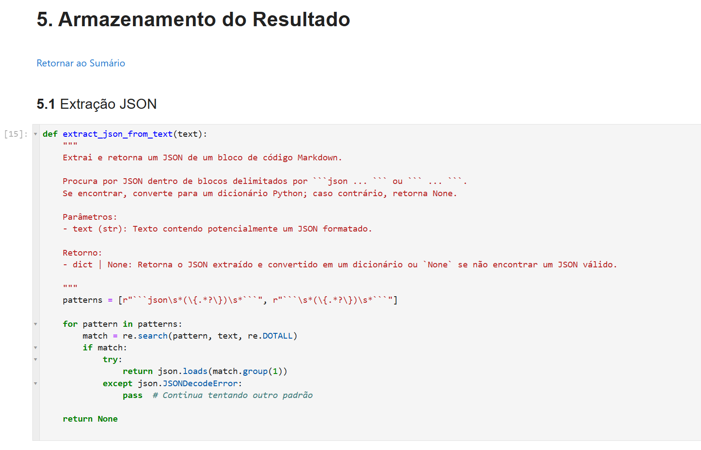


>### *Explicação:*
><br>
>   1. **Criação e Extração de Dados**:  
>       - Tenta acessar `data_list`, criando uma lista vazia se não existir.  
>       - Chama `extract_json_from_text(llm_text)`, que extrai o **JSON** da resposta do modelo de IA.  
>       - Se houver dados, adiciona à `data_list`.
>   2. **Conversão para DataFrame**:  
>       - `df = pd.DataFrame(data_list)` converte a lista de dicionários em um **DataFrame Pandas**.
>   3. **Apresentação dos Dados**:  
>       - `print(extracted_data)` exibe o **JSON extraído**.  
>       - `df` exibe o **DataFrame**, mostrando os **dados estruturados do documento**.

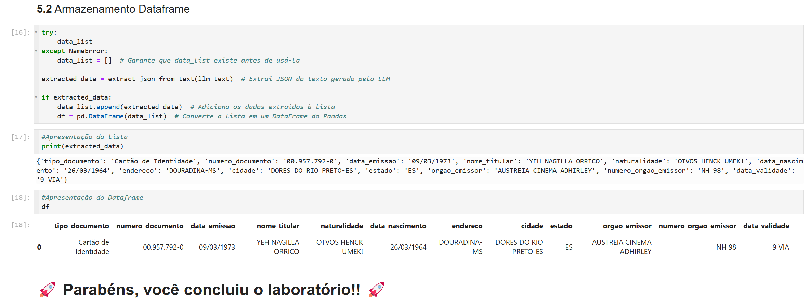

## 👥 Agradecimentos

- **Autores** - Isabelle Anjos
- **Autores Contribuintes** - Caio Oliveira, Gabriela Miyazima, Aristotelles Serra
- **Última Atualização Por/Data** - Janeiro 2025

## 🛡️ Declaração de Porto Seguro (Safe Harbor)

O tutorial apresentado tem como objetivo traçar a orientação dos nossos produtos em geral. É destinado somente a fins informativos e não pode ser incorporado a um contrato. Ele não representa um compromisso de entrega de qualquer tipo de material, código ou funcionalidade e não deve ser considerado em decisões de compra. O desenvolvimento, a liberação, a data de disponibilidade e a precificação de quaisquer funcionalidades ou recursos descritos para produtos da Oracle estão sujeitos a mudanças e são de critério exclusivo da Oracle Corporation.

Esta é a tradução de uma apresentação em inglês preparada para a sede da Oracle nos Estados Unidos. A tradução é realizada como cortesia e não está isenta de erros. Os recursos e funcionalidades podem não estar disponíveis em todos os países e idiomas. Caso tenha dúvidas, entre em contato com o representante de vendas da Oracle. 
